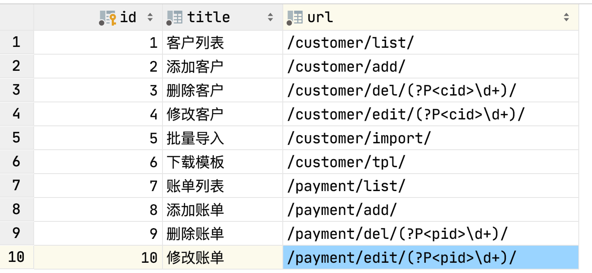
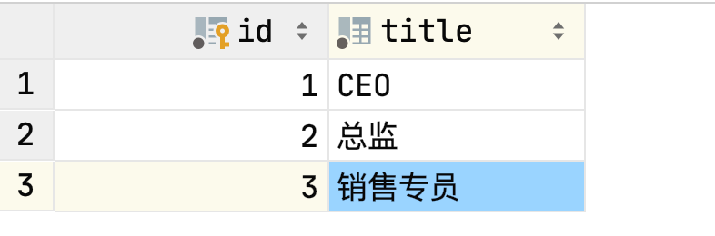
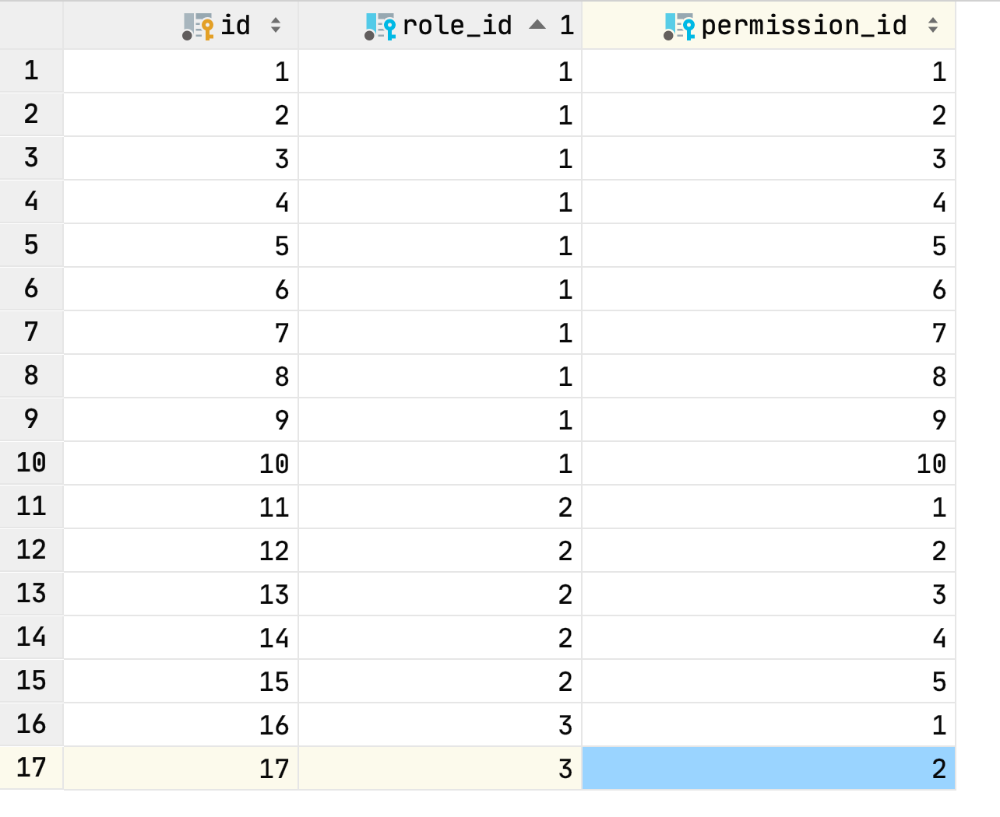
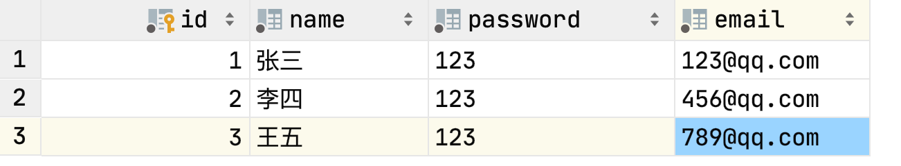
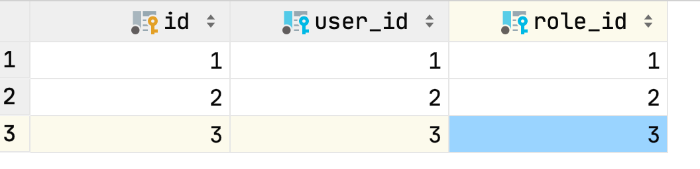
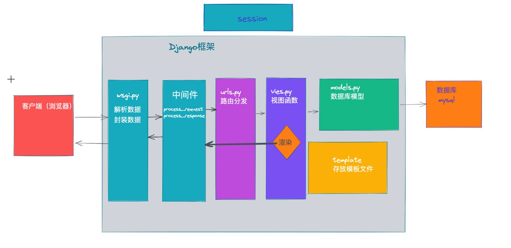

## 一. 权限组件

### 1.1 权限组件介绍

1. 为什么需要权限控制

   ```
   针对不同的用户进行不同权限的操作
   ```

   - 你能看到同事的薪水吗？老板可以
   - 你能和女神玩耍吗？马化腾可以

2. 为什么要开发权限组件

   ```
   基本所有的系统都会有关于权限的操作
   ```

3. Web中什么是权限？

   ```
   一个URL就是一个权限
   
   不同的URL对应不同的请求，而一个请求就对应一个应答，你有多少权限，其实就是你有多少个能访问的URL
   ```

### 1.2 第一版表结构设计

- 用户表
- 权限表
- 用户权限关系表

用户表和权限表是一个多对多的关系

在代码中就是两个类，三张表

```python
# 创建权限类
class Privilege(models.Model):
    id = models.AutoField(auto_increment=True, primary_key=True)
    urls = models.CharField(max_length=128)


# 创建用户类
class User(models.Model):
    id = models.AutoField(auto_increment=True, primary_key=True)
    name = models.CharField(max_length=32)
    urls = models.ManyToManyField(to='Privilege', null=True)
```

缺点：

对同类的用户做权限的增删改查太麻烦，比如张三李四都是主管，他们拥有相同的权限，当对销售专管做权限操作的时候，张三李四拥有的权限都要修改，我们可以将销售主管这个角色抽离出来，将角色分配给人，将权限分配给角色


### 1.3 第二版表结构设计

- 用户表
- 权限表
- 角色表
- 用户角色关系表（多对多）
- 角色权限表（多对多）

在代码中就是三个类，五张表

```python
class Permission(models.Model):
    """
    权限类
    """
    title = models.CharField(max_length=32, verbose_name='标题')
    url = models.CharField(max_length=128, verbose_name='含正则的URL')

    def __str__(self):
        return self.title


class Role(models.Model):
    """
    角色表
    """
    title = models.CharField(max_length=32, verbose_name='角色名称')
    permissions = models.ManyToManyField(to='Permission', verbose_name='拥有的所有权限', blank=True)

    def __str__(self):
        return self.title


class User(models.Model):
    """
    用户表
    """
    name = models.CharField(max_length=32, verbose_name='用户名')
    password = models.CharField(max_length=32, verbose_name='密码')
    email = models.CharField(max_length=32, verbose_name='邮箱')
    roles = models.ManyToManyField(to='Role', verbose_name='拥有的所有角色', blank=True)

    def __str__(self):
        return self.name

```

### 1.4 web应用

为了更好的实现权限组键，我们在创建一个web的应用，将业务实现在该应用中

销售系统的业务代码实现

### 1.5 将web中实现的权限的录入权限表中

1. 权限表



2. 角色表

   

3. 角色权限关系表
   

4. 用户表
   

5. 用户角色表
   

### 1.6 快速完成基本权限控制

设计思路：


1. 用户第一次请求从登录页面开始
   1. 用户发起登录页面的GET请求
   2. 服务端响应登录页面
2. 用户将登陆信息通过POST方式发送
3. 获取当前用户的所有权限信息并放入session中
4. 用户再次发起请求，请求中就会有该用户的所有权限信息，在中间件中判断用户访问的URL是否在该用户的权限中

知识点：

1. ORM:跨表查询
2. 中间件
   process_request函数中返回None则可以继续执行下面的中间件，否则返回
3. session
   设置中间件，获取中间件
4. DJango在寻找模板文件的时候优先去最外层目录照templates文件夹，如果没有找到，就会按照app注册的顺序去子项目的templates中寻找
5. 正则匹配

模板函数：

```python
from django.shortcuts import HttpResponse, render, redirect
# TBD: 不要跨项目引入
from rbac.models import User


def login(request):
    if request.method == "GET":
        return render(request, 'login.html')
    username = request.POST.get('username')
    password = request.POST.get('password')
    print(username, password)
    user_obj = User.objects.filter(name=username, password=password).first()
    if not user_obj:
        # 用户名或者密码不正确
        return render(request, 'login.html', {"info": '用户名或者密码不正确'})
    # 登陆成功，查找该用户的所有权限
    """
    本次查询垮了两张表，注意去重和为空的筛选
    """
    permission_queryset = user_obj.roles.filter(permissions__isnull=False).values('permissions__id',                                                                                																																							'permissions__url').distinct()
    # 获取权限中的所有URL
    permission_list = [item['permissions__url'] for item in permission_queryset]

    # 将权限信息写入session中
    request.session['luffy_permission_url_list'] = permission_list
    return redirect('/customer/list/')

```

中间件

```python
import re
from django.utils.deprecation import MiddlewareMixin
from django.shortcuts import render, redirect, HttpResponse


class CheckPermission(MiddlewareMixin):
    """
    用户权限信息校验
    """

    def process_request(self, request):
        """
        验证用户权限
        :param request:
        :return:
        """
        # 白名单
        valid_url_list = [
            '/login/',
            '/admin/*'
        ]
        # 获取当前请求的url
        current_url = request.path_info

        # 判断url是否在白名单里面
        for item in valid_url_list:
            item = "^%s$" % item
            if re.match(item, current_url):
                return None

        # 获取当前用户session中的权限
        permission_list = request.session['luffy_permission_url_list']
        if not permission_list:
            return HttpResponse('为获取用户权限信息，请登录')

        # 判断用户当前请求是否在session中
        flag = False
        for url in permission_list:
            # 匹配应该严格
            reg = "^%s$" % url
            # 用户拥有权限
            if re.match(reg, current_url):
                flag = True
                break

        if not flag:
            return HttpResponse('无权访问')

```

### 1.7 以上代码的优化完善

1. 用户登录和权限初始化的分离

2. 将配置信息放入项目的配置文件中setting.py

   ```python
   from django.conf import settings
   ```

3. 将中间件整合到权限组件中

### 1.8 动态菜单

常见菜单：

- 一级菜单
- 二级菜单(最常见)

#### 1.8.1 一级菜单设计思路

1. 修改数据库权限表，再加一列，判断该权限能否成为一级菜单,添加图标
2. 在用户认证成功之后，将一级菜单也写入session中
3. 用户再次发起请求时，读取session中的一级菜单，渲染在页面中

知识点：

1. 图标网站：https://fontawesome.dashgame.com/
2. 在上述第三步中，学习了`inclusion_tag`

表结构

```
from django.db import models


class Permission(models.Model):
    """
    权限类
    """
    title = models.CharField(max_length=32, verbose_name='标题')
    url = models.CharField(max_length=128, verbose_name='含正则的URL')
    is_menu = models.BooleanField(verbose_name='是否可以做菜单', default=False)
    icon = models.CharField(max_length=64, verbose_name='图标', null=True, blank=True)

    def __str__(self):
        return self.title


class Role(models.Model):
    """
    角色表
    """
    title = models.CharField(max_length=32, verbose_name='角色名称')
    permissions = models.ManyToManyField(to='Permission', verbose_name='拥有的所有权限', blank=True)

    def __str__(self):
        return self.title


class User(models.Model):
    """
    用户表
    """
    name = models.CharField(max_length=32, verbose_name='用户名')
    password = models.CharField(max_length=32, verbose_name='密码')
    email = models.CharField(max_length=32, verbose_name='邮箱')
    roles = models.ManyToManyField(to='Role', verbose_name='拥有的所有角色', blank=True)

    def __str__(self):
        return self.name

```

模板文件
layout.html

```



```

```


<!DOCTYPE html>
<html lang="en">
<head>
    <meta charset="UTF-8">
    <title>路飞学城</title>
    <link rel="shortcut icon" href=" ">
    <link rel="stylesheet" href=" "/>
    <link rel="stylesheet" href=" "/>
    <link rel="stylesheet" href=" "/>
    <link rel="stylesheet" href=" "/>
    <style>
        body {
            margin: 0;
        }

        .no-radius {
            border-radius: 0;
        }

        .no-margin {
            margin: 0;
        }

        .pg-body > .left-menu {
            background-color: #EAEDF1;
            position: absolute;
            left: 1px;
            top: 48px;
            bottom: 0;
            width: 220px;
            border: 1px solid #EAEDF1;
            overflow: auto;
        }

        .pg-body > .right-body {
            position: absolute;
            left: 225px;
            right: 0;
            top: 48px;
            bottom: 0;
            overflow: scroll;
            border: 1px solid #ddd;
            border-top: 0;
            font-size: 13px;
            min-width: 755px;
        }

        .navbar-right {
            float: right !important;
            margin-right: -15px;
        }

        .luffy-container {
            padding: 15px;
        }

        .left-menu .menu-body .static-menu {

        }

        .left-menu .menu-body .static-menu .icon-wrap {
            width: 20px;
            display: inline-block;
            text-align: center;
        }

        .left-menu .menu-body .static-menu a {
            text-decoration: none;
            padding: 8px 15px;
            border-bottom: 1px solid #ccc;
            color: #333;
            display: block;
            background: #efefef;
            background: -webkit-gradient(linear, left bottom, left top, color-stop(0, #efefef), color-stop(1, #fafafa));
            background: -ms-linear-gradient(bottom, #efefef, #fafafa);
            background: -moz-linear-gradient(center bottom, #efefef 0%, #fafafa 100%);
            background: -o-linear-gradient(bottom, #efefef, #fafafa);
            filter: progid:dximagetransform.microsoft.gradient(startColorStr='#e3e3e3', EndColorStr='#ffffff');
            -ms-filter: "progid:DXImageTransform.Microsoft.gradient(startColorStr='#fafafa',EndColorStr='#efefef')";
            box-shadow: inset 0px 1px 1px white;
        }

        .left-menu .menu-body .static-menu a:hover {
            color: #2F72AB;
            border-left: 2px solid #2F72AB;
        }

        .left-menu .menu-body .static-menu a.active {
            color: #2F72AB;
            border-left: 2px solid #2F72AB;
        }
    </style>
</head>
<body>

<div class="pg-header">
    <div class="nav">
        <div class="logo-area left">
            <a href="#">
                
                <span style="font-size: 18px;">路飞学城 </span>
            </a>
        </div>

        <div class="left-menu left">
            <a class="menu-item">资产管理</a>
            <a class="menu-item">用户信息</a>
            <a class="menu-item">路飞管理</a>
            <div class="menu-item">
                <span>使用说明</span>
                <i class="fa fa-caret-down" aria-hidden="true"></i>
                <div class="more-info">
                    <a href="#" class="more-item">管他什么菜单</a>
                    <a href="#" class="more-item">实在是编不了</a>
                </div>
            </div>
        </div>

        <div class="right-menu right clearfix">

            <div class="user-info right">
                <a href="#" class="avatar">
                    
                </a>

                <div class="more-info">
                    <a href="#" class="more-item">个人信息</a>
                    <a href="#" class="more-item">注销</a>
                </div>
            </div>

            <a class="user-menu right">
                消息
                <i class="fa fa-commenting-o" aria-hidden="true"></i>
                <span class="badge bg-success">2</span>
            </a>

            <a class="user-menu right">
                通知
                <i class="fa fa-envelope-o" aria-hidden="true"></i>
                <span class="badge bg-success">2</span>
            </a>

            <a class="user-menu right">
                任务
                <i class="fa fa-bell-o" aria-hidden="true"></i>
                <span class="badge bg-danger">4</span>
            </a>
        </div>

    </div>
</div>
<div class="pg-body">
    <div class="left-menu">
        <div class="menu-body">
            

        </div>
    </div>
    <div class="right-body">
        <div>
            <ol class="breadcrumb no-radius no-margin" style="border-bottom: 1px solid #ddd;">

                <li><a href="#">首页</a></li>
                <li class="active">客户管理</li>

            </ol>
        </div>
         
    </div>
</div>


<script src=" "></script>
<script src=" "></script>
 
</body>
</html>
```


函数

```
from django.template import Library
from django.conf import settings

register = Library()


@register.inclusion_tag('rbac/static_menu.html')
def static_menu(request):
    """
    创建一级菜单
    :return: 
    """
    current_url= request.path_info
    menu_list = request.session.get(settings.MENU_SESSION_KEY)
    return {'menu_list': menu_list, 'current_url':current_url}

```

模板文件：static_menu.html

```
<div class="static-menu">
    
    <a href="{{ item.url }}" class="} active }">
        <span class="icon-wrap">
            <i class="{{ item.icon }}"></i>
        </span>
        {{ item.title }}
    </a>
    
</div>
```

#### 1.8.2 二级菜单设计思路

session中储存的数据结构需要变更，支持两次循环，渲染到页面

设计思路：

1. 改善数据库表，下面的数据结构
2. 构建对应的数据结构，放在session中
3. 从session中获取该数据结构，渲染在页面

```python
{
    1: {
        'title': '信息管理',
        'icon': 'x1',
        'children': [
            {'title': '客户列表', 'url': '/customer/list/', 'icon': 'x2'},
            {'title': '张丹列表', 'url': '/payment/list/', 'icon': 'x3'}
        ]

    },
    2: {
        'title': '用户信息',
        'icon': 'x4',
        'children': [
            {'title': '个人资料', 'url': '/userInfo/list/', 'icon': 'x5'},
        ]

    }
}
```


数据库表结构修改

```python
from django.db import models


class Menu(models.Model):
    """
    一级菜单表
    """
    title = models.CharField(max_length=32, verbose_name='一级菜单名称')
    icon = models.CharField(max_length=64, verbose_name='图标', null=True, blank=True)

    def __str__(self):
        return self.title


class Permission(models.Model):
    """
    权限表
    """
    title = models.CharField(max_length=32, verbose_name='标题')
    url = models.CharField(max_length=128, verbose_name='含正则的URL')
    is_menu = models.BooleanField(verbose_name='是否可以做菜单', default=False)
    icon = models.CharField(max_length=64, verbose_name='图标', null=True, blank=True)
    menu = models.ForeignKey(to='Menu', verbose_name='所属的一级菜单', on_delete=models.CASCADE, null=True,
                             help_text='null表示不是菜单，否则代表二级菜单')

    def __str__(self):
        return self.title


class Role(models.Model):
    """
    角色表
    """
    title = models.CharField(max_length=32, verbose_name='角色名称')
    permissions = models.ManyToManyField(to='Permission', verbose_name='拥有的所有权限', blank=True)

    def __str__(self):
        return self.title


class User(models.Model):
    """
    用户表
    """
    name = models.CharField(max_length=32, verbose_name='用户名')
    password = models.CharField(max_length=32, verbose_name='密码')
    email = models.CharField(max_length=32, verbose_name='邮箱')
    roles = models.ManyToManyField(to='Role', verbose_name='拥有的所有角色', blank=True)

    def __str__(self):
        return self.name

```

函数：

```
import re
from django.template import Library
from django.conf import settings
from collections import OrderedDict

register = Library()


# @register.inclusion_tag('rbac/static_menu.html')
# def static_menu(request):
#     """
#     创建一级菜单
#     :return:
#     """
#     current_url = request.path_info
#     menu_list = request.session.get(settings.MENU_SESSION_KEY)
#     return {'menu_list': menu_list, 'current_url': current_url}

@register.inclusion_tag('rbac/multi_menu.html')
def multi_menu(request):
    """
    创建二级菜单
    :return:
    """
    current_url = request.path_info
    menu_dict = request.session.get(settings.MENU_SESSION_KEY)
    # 将无序的字典转换为有序的
    key_list = sorted(menu_dict)
    ordered_dict = OrderedDict()

    for key in key_list:
        val = menu_dict[key]
        val['class'] = 'hide'
        for per in val['children']:
            regex = '^%s$' %per['url']
            if re.match(regex, request.path_info):
                val['class'] = ''
                per['class'] = 'active'
        ordered_dict[key] = val
    # 格式如下
    """
    {
        1: {
            'title': '信息管理',
            'icon': 'fa fa-audio-description',
            'children': [
                {
                    'title': '客户列表',
                    'url': '/customer/list/', 'icon': 'fa fa-address-book-o'
           					'class':'active'
                }
            ]
        },
        2: {
            'title': '用户管理',
            'icon': 'fa fa-car',
            'class':'hide'
            'children': [
                {
                    'title': '账单列表',
                    'url': '/payment/list/',
                    'icon': 'fa fa-id-card'
                }
            ]
        }
    }
    """
    return {'ordered_dict': ordered_dict, 'current_url': current_url}

```

知识点：

1. 在渲染到页面的时候，通过JS控制菜单的点击事件
2. 构建数据结构的时候，将无序字典转化为有序字典，同时添加class字段到构建的数据结构中，更好的渲染页面

### 1.9 导航条制作

思路：

1. 在初始化的时候，将所有的权限的父权限标题和url也传递到权限列表中

   ```python
   permission_list.append(
     {
       'id': item['permissions__id'],
       'url': item['permissions__url'],
       'pid': item['permissions__pid__id'],
       'title': item['permissions__title'],
       'p_title': item['permissions__pid__title'],
       'p_url': item['permissions__pid__url'],
     }
   )
   ```

2. 在中间键中将访问的权限的父权限及本身存入列表中，通过request传递给inclusion_tag中

   ```python
   if re.match(reg, current_url):
     flag = True
     # 菜单选中
     request.current_selected_permission = item['pid'] or item['id']
     # 导航条
     if not item['pid']:
       url_record.append(
         {'url': item['url'], 'title': item['title']}
       )
       else:
         url_record.extend([
           {'url': item['p_url'], 'title': item['p_title']},
           {'url': item['url'], 'title': item['title']}
         ])
         request.url_record = url_record
         break
   ```

3. 渲染到页面中

   1. 更上面动态菜单一样，写一个注册函数

      ```python
      @register.inclusion_tag('rbac/url_record.html')
      def url_record(request):
          return {'url_record': request.url_record}
      ```

   2. 创建html文件

      ```html
      <div>
          <ol class="breadcrumb no-radius no-margin" style="border-bottom: 1px solid #ddd;">
      
              
                  
                      <li>{{ item.title }}</li>
                  
                      <li><a href="{{ item.url }}">{{ item.title }}</a></li>
              
              
      
          </ol>
      </div>
      ```

### 1.10 权限控制力度到按钮

1. 在数据库权限模型中添加name字段，为权限的别名

   ```python
   class Permission(models.Model):
       """
       权限表
       """
       title = models.CharField(max_length=32, verbose_name='标题')
       url = models.CharField(max_length=128, verbose_name='含正则的URL')
       name = models.CharField(max_length=32, verbose_name='URL的别名', unique=True)
       is_menu = models.BooleanField(verbose_name='是否可以做菜单', default=False)
       icon = models.CharField(max_length=64, verbose_name='图标', null=True, blank=True)
       menu = models.ForeignKey(to='Menu', verbose_name='所属的一级菜单', on_delete=models.CASCADE, null=True,
                                help_text='null表示不是菜单，否则代表二级菜单')
       pid = models.ForeignKey(to='Permission', related_name='parents', verbose_name='关联的权限', help_text='该权限不是菜单，关联一个权限',
                               null=True, on_delete=models.CASCADE)
   
       def __str__(self):
           return self.title
   ```

   

2. 在初始化权限时，修改权限列表为字典，键为权限的别名

   ```python
   from django.conf import settings
   
   
   def init_permission(user_obj, request):
       """
       用户权限的初始化
       :param user_obj: 当前登陆用户
       :param request: 请求
       :return:
       """
   
       # 本次查询垮了三张表，注意去重和为空的筛选
       permission_queryset = user_obj.roles.filter(permissions__isnull=False).values('permissions__id',
                                                                                     'permissions__title',
                                                                                     'permissions__url',
                                                                                     'permissions__name',                                                                             																																														'permissions__pid__id',                                                                                 'permissions__pid__title',
   'permissions__pid__url',
   'permissions__menu__icon',                                                                           'permissions__menu__title',
     ).distinct()
       # 获取权限中的所有URL+菜单信
       menu_dict = {}
       permission_dict = {}
       for item in permission_queryset:
           permission_dict[item['permissions__name']] = {
               'id': item['permissions__id'],
               'url': item['permissions__url'],
               'pid': item['permissions__pid__id'],
               'title': item['permissions__title'],
               'p_title': item['permissions__pid__title'],
               'p_url': item['permissions__pid__url'],
           }
           menu_id = item['permissions__menu__id']
           if not menu_id:
               continue
           node = {
               'title': item['permissions__title'],
               'url': item['permissions__url'],
               'icon': item['permissions__icon'],
               'id': item['permissions__id']
           }
           if menu_id in menu_dict:
               menu_dict[menu_id]['children'].append(node)
           else:
               menu_dict[menu_id] = {
                   'title': item['permissions__menu__title'],
                   'icon': item['permissions__menu__icon'],
                   'children': [node],
               }
       print(permission_dict)
       # 将权限信息写入session中
       request.session[settings.PERMISSION_SESSION_KEY] = permission_dict
       # 将菜单信息写入session中
       request.session[settings.MENU_SESSION_KEY] = menu_dict
   
   ```

   

3. 渲染时自定义过滤器，判定按钮能否显示在页面上

   1. 过滤函数

      ```
      @register.filter
      def has_permission(request, name):
          """
          判断是否有权限
          :param request:
          :param name:
          :return:
          """
          if name in request.session.get(settings.PERMISSION_SESSION_KEY):
              return True
      ```

   2. 模板文件

      ```python
      
        <a class="btn btn-success" href="/payment/add/">
        <i class="fa fa-plus-square" aria-hidden="true"></i> 添加缴费记录
        </a>
      
      ```

      

## 二. 增删改查组件

## 三. CRM业务组件