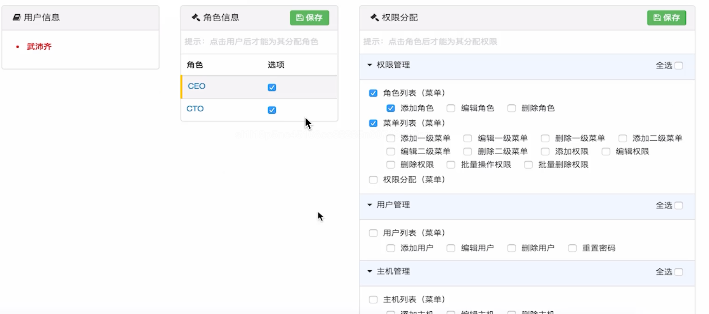
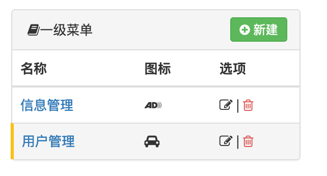
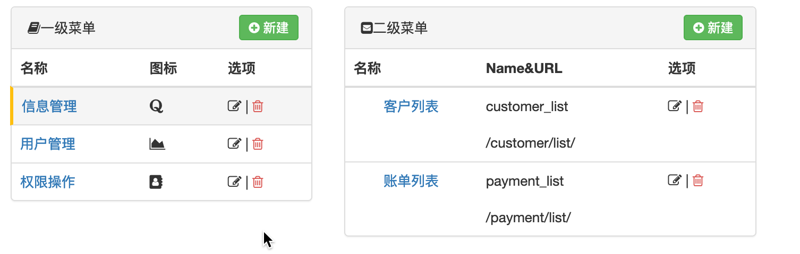
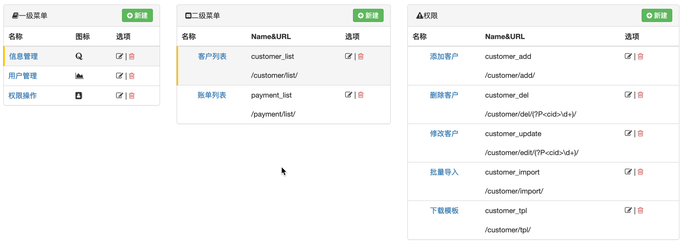
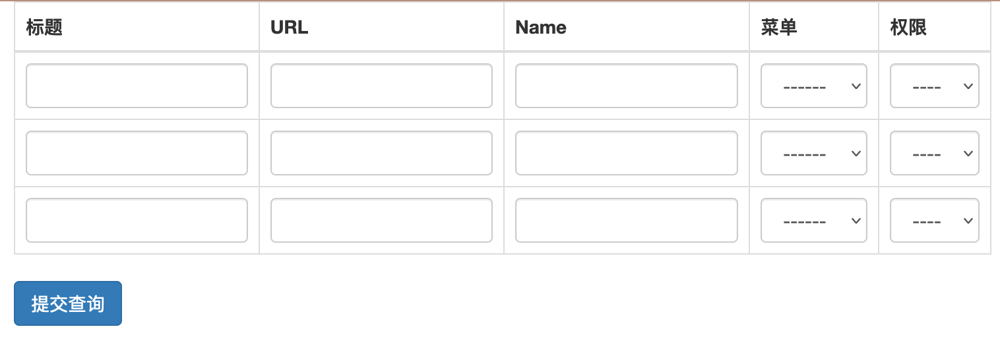
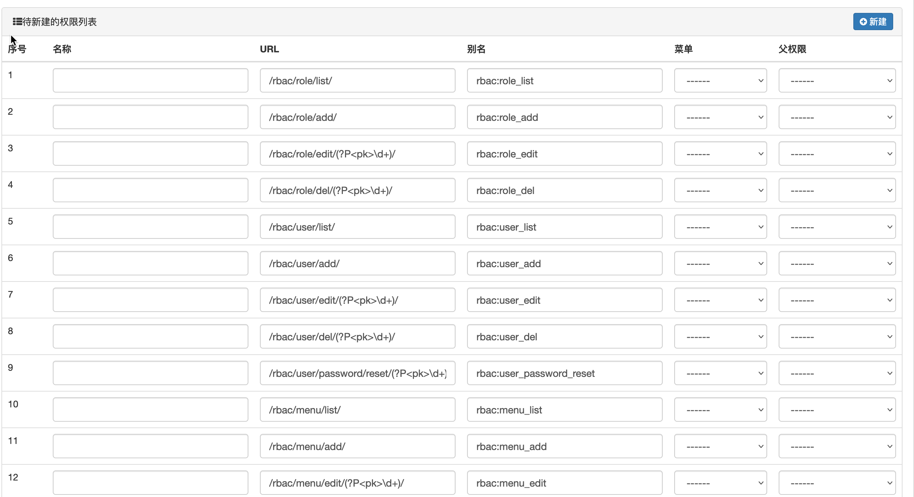
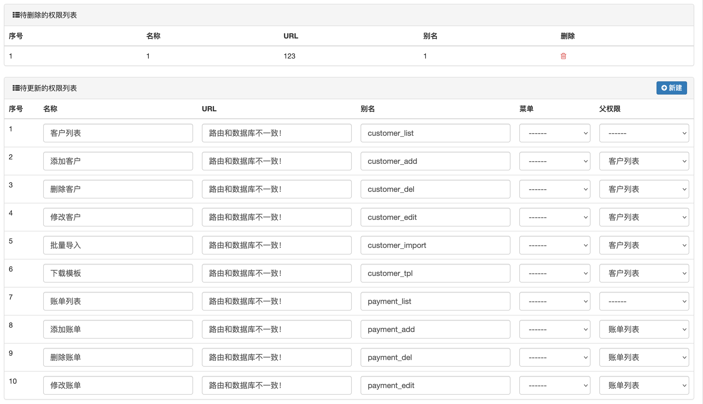
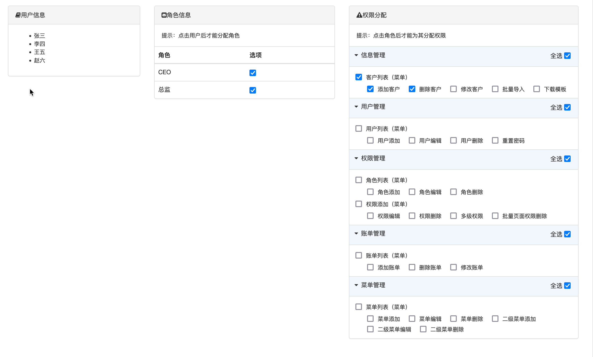

#### 一. 权限组件

### 1.1 权限组件介绍

1. 为什么需要权限控制

   ```
   针对不同的用户进行不同权限的操作
   ```

   - 你能看到同事的薪水吗？老板可以
   - 你能和女神玩耍吗？马化腾可以

2. 为什么要开发权限组件

   ```
   基本所有的系统都会有关于权限的操作
   ```

3. Web中什么是权限？

   ```
   一个URL就是一个权限
   
   不同的URL对应不同的请求，而一个请求就对应一个应答，你有多少权限，其实就是你有多少个能访问的URL
   ```

### 1.2 第一版表结构设计

- 用户表
- 权限表
- 用户权限关系表

用户表和权限表是一个多对多的关系

在代码中就是两个类，三张表

```python
# 创建权限类
class Privilege(models.Model):
    id = models.AutoField(auto_increment=True, primary_key=True)
    urls = models.CharField(max_length=128)


# 创建用户类
class User(models.Model):
    id = models.AutoField(auto_increment=True, primary_key=True)
    name = models.CharField(max_length=32)
    urls = models.ManyToManyField(to='Privilege', null=True)
```

缺点：

对同类的用户做权限的增删改查太麻烦，比如张三李四都是主管，他们拥有相同的权限，当对销售专管做权限操作的时候，张三李四拥有的权限都要修改，我们可以将销售主管这个角色抽离出来，将角色分配给人，将权限分配给角色


### 1.3 第二版表结构设计

- 用户表
- 权限表
- 角色表
- 用户角色关系表（多对多）
- 角色权限表（多对多）

在代码中就是三个类，五张表

```python
class Permission(models.Model):
    """
    权限类
    """
    title = models.CharField(max_length=32, verbose_name='标题')
    url = models.CharField(max_length=128, verbose_name='含正则的URL')

    def __str__(self):
        return self.title


class Role(models.Model):
    """
    角色表
    """
    title = models.CharField(max_length=32, verbose_name='角色名称')
    permissions = models.ManyToManyField(to='Permission', verbose_name='拥有的所有权限', blank=True)

    def __str__(self):
        return self.title


class User(models.Model):
    """
    用户表
    """
    name = models.CharField(max_length=32, verbose_name='用户名')
    password = models.CharField(max_length=32, verbose_name='密码')
    email = models.CharField(max_length=32, verbose_name='邮箱')
    roles = models.ManyToManyField(to='Role', verbose_name='拥有的所有角色', blank=True)

    def __str__(self):
        return self.name

```

### 1.4 web应用

为了更好的实现权限组键，我们在创建一个web的应用，将业务实现在该应用中

销售系统的业务代码实现

### 1.5 将web中实现的权限的录入权限表中

1. 权限表


2. 角色表

   

3. 角色权限关系表
   

4. 用户表
   

5. 用户角色表
   

### 1.6 快速完成基本权限控制

设计思路：


1. 用户第一次请求从登录页面开始
   1. 用户发起登录页面的GET请求
   2. 服务端响应登录页面
2. 用户将登陆信息通过POST方式发送
3. 获取当前用户的所有权限信息并放入session中
4. 用户再次发起请求，请求中就会有该用户的所有权限信息，在中间件中判断用户访问的URL是否在该用户的权限中

知识点：

1. ORM:跨表查询
2. 中间件
   process_request函数中返回None则可以继续执行下面的中间件，否则返回
3. session
   设置中间件，获取中间件
4. DJango在寻找模板文件的时候优先去最外层目录照templates文件夹，如果没有找到，就会按照app注册的顺序去子项目的templates中寻找
5. 正则匹配

模板函数：

```python
from django.shortcuts import HttpResponse, render, redirect
# TBD: 不要跨项目引入
from rbac.models import User


def login(request):
    if request.method == "GET":
        return render(request, 'login.html')
    username = request.POST.get('username')
    password = request.POST.get('password')
    print(username, password)
    user_obj = User.objects.filter(name=username, password=password).first()
    if not user_obj:
        # 用户名或者密码不正确
        return render(request, 'login.html', {"info": '用户名或者密码不正确'})
    # 登陆成功，查找该用户的所有权限
    """
    本次查询垮了两张表，注意去重和为空的筛选
    """
    permission_queryset = user_obj.roles.filter(permissions__isnull=False).values('permissions__id',                                                                                																																							'permissions__url').distinct()
    # 获取权限中的所有URL
    permission_list = [item['permissions__url'] for item in permission_queryset]

    # 将权限信息写入session中
    request.session['luffy_permission_url_list'] = permission_list
    return redirect('/customer/list/')

```

中间件

```python
import re
from django.utils.deprecation import MiddlewareMixin
from django.shortcuts import render, redirect, HttpResponse


class CheckPermission(MiddlewareMixin):
    """
    用户权限信息校验
    """

    def process_request(self, request):
        """
        验证用户权限
        :param request:
        :return:
        """
        # 白名单
        valid_url_list = [
            '/login/',
            '/admin/*'
        ]
        # 获取当前请求的url
        current_url = request.path_info

        # 判断url是否在白名单里面
        for item in valid_url_list:
            item = "^%s$" % item
            if re.match(item, current_url):
                return None

        # 获取当前用户session中的权限
        permission_list = request.session['luffy_permission_url_list']
        if not permission_list:
            return HttpResponse('为获取用户权限信息，请登录')

        # 判断用户当前请求是否在session中
        flag = False
        for url in permission_list:
            # 匹配应该严格
            reg = "^%s$" % url
            # 用户拥有权限
            if re.match(reg, current_url):
                flag = True
                break

        if not flag:
            return HttpResponse('无权访问')

```

### 1.7 以上代码的优化完善

1. 用户登录和权限初始化的分离

2. 将配置信息放入项目的配置文件中setting.py

   ```python
   from django.conf import settings
   ```

3. 将中间件整合到权限组件中

### 1.8 动态菜单

常见菜单：

- 一级菜单
- 二级菜单(最常见)

#### 1.8.1 一级菜单设计思路

1. 修改数据库权限表，再加一列，判断该权限能否成为一级菜单,添加图标
2. 在用户认证成功之后，将一级菜单也写入session中
3. 用户再次发起请求时，读取session中的一级菜单，渲染在页面中

知识点：

1. 图标网站：https://fontawesome.dashgame.com/
2. 在上述第三步中，学习了`inclusion_tag`

表结构

```
from django.db import models


class Permission(models.Model):
    """
    权限类
    """
    title = models.CharField(max_length=32, verbose_name='标题')
    url = models.CharField(max_length=128, verbose_name='含正则的URL')
    is_menu = models.BooleanField(verbose_name='是否可以做菜单', default=False)
    icon = models.CharField(max_length=64, verbose_name='图标', null=True, blank=True)

    def __str__(self):
        return self.title


class Role(models.Model):
    """
    角色表
    """
    title = models.CharField(max_length=32, verbose_name='角色名称')
    permissions = models.ManyToManyField(to='Permission', verbose_name='拥有的所有权限', blank=True)

    def __str__(self):
        return self.title


class User(models.Model):
    """
    用户表
    """
    name = models.CharField(max_length=32, verbose_name='用户名')
    password = models.CharField(max_length=32, verbose_name='密码')
    email = models.CharField(max_length=32, verbose_name='邮箱')
    roles = models.ManyToManyField(to='Role', verbose_name='拥有的所有角色', blank=True)

    def __str__(self):
        return self.name

```

模板文件
layout.html

```



```

```


<!DOCTYPE html>
<html lang="en">
<head>
    <meta charset="UTF-8">
    <title>路飞学城</title>
    <link rel="shortcut icon" href=" ">
    <link rel="stylesheet" href=" "/>
    <link rel="stylesheet" href=" "/>
    <link rel="stylesheet" href=" "/>
    <link rel="stylesheet" href=" "/>
    <style>
        body {
            margin: 0;
        }

        .no-radius {
            border-radius: 0;
        }

        .no-margin {
            margin: 0;
        }

        .pg-body > .left-menu {
            background-color: #EAEDF1;
            position: absolute;
            left: 1px;
            top: 48px;
            bottom: 0;
            width: 220px;
            border: 1px solid #EAEDF1;
            overflow: auto;
        }

        .pg-body > .right-body {
            position: absolute;
            left: 225px;
            right: 0;
            top: 48px;
            bottom: 0;
            overflow: scroll;
            border: 1px solid #ddd;
            border-top: 0;
            font-size: 13px;
            min-width: 755px;
        }

        .navbar-right {
            float: right !important;
            margin-right: -15px;
        }

        .luffy-container {
            padding: 15px;
        }

        .left-menu .menu-body .static-menu {

        }

        .left-menu .menu-body .static-menu .icon-wrap {
            width: 20px;
            display: inline-block;
            text-align: center;
        }

        .left-menu .menu-body .static-menu a {
            text-decoration: none;
            padding: 8px 15px;
            border-bottom: 1px solid #ccc;
            color: #333;
            display: block;
            background: #efefef;
            background: -webkit-gradient(linear, left bottom, left top, color-stop(0, #efefef), color-stop(1, #fafafa));
            background: -ms-linear-gradient(bottom, #efefef, #fafafa);
            background: -moz-linear-gradient(center bottom, #efefef 0%, #fafafa 100%);
            background: -o-linear-gradient(bottom, #efefef, #fafafa);
            filter: progid:dximagetransform.microsoft.gradient(startColorStr='#e3e3e3', EndColorStr='#ffffff');
            -ms-filter: "progid:DXImageTransform.Microsoft.gradient(startColorStr='#fafafa',EndColorStr='#efefef')";
            box-shadow: inset 0px 1px 1px white;
        }

        .left-menu .menu-body .static-menu a:hover {
            color: #2F72AB;
            border-left: 2px solid #2F72AB;
        }

        .left-menu .menu-body .static-menu a.active {
            color: #2F72AB;
            border-left: 2px solid #2F72AB;
        }
    </style>
</head>
<body>

<div class="pg-header">
    <div class="nav">
        <div class="logo-area left">
            <a href="#">
                
                <span style="font-size: 18px;">路飞学城 </span>
            </a>
        </div>

        <div class="left-menu left">
            <a class="menu-item">资产管理</a>
            <a class="menu-item">用户信息</a>
            <a class="menu-item">路飞管理</a>
            <div class="menu-item">
                <span>使用说明</span>
                <i class="fa fa-caret-down" aria-hidden="true"></i>
                <div class="more-info">
                    <a href="#" class="more-item">管他什么菜单</a>
                    <a href="#" class="more-item">实在是编不了</a>
                </div>
            </div>
        </div>

        <div class="right-menu right clearfix">

            <div class="user-info right">
                <a href="#" class="avatar">
                    
                </a>

                <div class="more-info">
                    <a href="#" class="more-item">个人信息</a>
                    <a href="#" class="more-item">注销</a>
                </div>
            </div>

            <a class="user-menu right">
                消息
                <i class="fa fa-commenting-o" aria-hidden="true"></i>
                <span class="badge bg-success">2</span>
            </a>

            <a class="user-menu right">
                通知
                <i class="fa fa-envelope-o" aria-hidden="true"></i>
                <span class="badge bg-success">2</span>
            </a>

            <a class="user-menu right">
                任务
                <i class="fa fa-bell-o" aria-hidden="true"></i>
                <span class="badge bg-danger">4</span>
            </a>
        </div>

    </div>
</div>
<div class="pg-body">
    <div class="left-menu">
        <div class="menu-body">
            

        </div>
    </div>
    <div class="right-body">
        <div>
            <ol class="breadcrumb no-radius no-margin" style="border-bottom: 1px solid #ddd;">

                <li><a href="#">首页</a></li>
                <li class="active">客户管理</li>

            </ol>
        </div>
         
    </div>
</div>


<script src=" "></script>
<script src=" "></script>
 
</body>
</html>
```


函数

```
from django.template import Library
from django.conf import settings

register = Library()


@register.inclusion_tag('rbac/static_menu.html')
def static_menu(request):
    """
    创建一级菜单
    :return: 
    """
    current_url= request.path_info
    menu_list = request.session.get(settings.MENU_SESSION_KEY)
    return {'menu_list': menu_list, 'current_url':current_url}

```

模板文件：static_menu.html

```
<div class="static-menu">
    
    <a href="{{ item.url }}" class="} active }">
        <span class="icon-wrap">
            <i class="{{ item.icon }}"></i>
        </span>
        {{ item.title }}
    </a>
    
</div>
```

#### 1.8.2 二级菜单设计思路

session中储存的数据结构需要变更，支持两次循环，渲染到页面

设计思路：

1. 改善数据库表，下面的数据结构
2. 构建对应的数据结构，放在session中
3. 从session中获取该数据结构，渲染在页面

```python
{
    1: {
        'title': '信息管理',
        'icon': 'x1',
        'children': [
            {'title': '客户列表', 'url': '/customer/list/', 'icon': 'x2'},
            {'title': '张丹列表', 'url': '/payment/list/', 'icon': 'x3'}
        ]

    },
    2: {
        'title': '用户信息',
        'icon': 'x4',
        'children': [
            {'title': '个人资料', 'url': '/userInfo/list/', 'icon': 'x5'},
        ]

    }
}
```


数据库表结构修改

```python
from django.db import models


class Menu(models.Model):
    """
    一级菜单表
    """
    title = models.CharField(max_length=32, verbose_name='一级菜单名称')
    icon = models.CharField(max_length=64, verbose_name='图标', null=True, blank=True)

    def __str__(self):
        return self.title


class Permission(models.Model):
    """
    权限表
    """
    title = models.CharField(max_length=32, verbose_name='标题')
    url = models.CharField(max_length=128, verbose_name='含正则的URL')
    is_menu = models.BooleanField(verbose_name='是否可以做菜单', default=False)
    icon = models.CharField(max_length=64, verbose_name='图标', null=True, blank=True)
    menu = models.ForeignKey(to='Menu', verbose_name='所属的一级菜单', on_delete=models.CASCADE, null=True,
                             help_text='null表示不是菜单，否则代表二级菜单')

    def __str__(self):
        return self.title


class Role(models.Model):
    """
    角色表
    """
    title = models.CharField(max_length=32, verbose_name='角色名称')
    permissions = models.ManyToManyField(to='Permission', verbose_name='拥有的所有权限', blank=True)

    def __str__(self):
        return self.title


class User(models.Model):
    """
    用户表
    """
    name = models.CharField(max_length=32, verbose_name='用户名')
    password = models.CharField(max_length=32, verbose_name='密码')
    email = models.CharField(max_length=32, verbose_name='邮箱')
    roles = models.ManyToManyField(to='Role', verbose_name='拥有的所有角色', blank=True)

    def __str__(self):
        return self.name

```

函数：

```
import re
from django.template import Library
from django.conf import settings
from collections import OrderedDict

register = Library()


# @register.inclusion_tag('rbac/static_menu.html')
# def static_menu(request):
#     """
#     创建一级菜单
#     :return:
#     """
#     current_url = request.path_info
#     menu_list = request.session.get(settings.MENU_SESSION_KEY)
#     return {'menu_list': menu_list, 'current_url': current_url}

@register.inclusion_tag('rbac/multi_menu.html')
def multi_menu(request):
    """
    创建二级菜单
    :return:
    """
    current_url = request.path_info
    menu_dict = request.session.get(settings.MENU_SESSION_KEY)
    # 将无序的字典转换为有序的
    key_list = sorted(menu_dict)
    ordered_dict = OrderedDict()

    for key in key_list:
        val = menu_dict[key]
        val['class'] = 'hide'
        for per in val['children']:
            regex = '^%s$' %per['url']
            if re.match(regex, request.path_info):
                val['class'] = ''
                per['class'] = 'active'
        ordered_dict[key] = val
    # 格式如下
    """
    {
        1: {
            'title': '信息管理',
            'icon': 'fa fa-audio-description',
            'children': [
                {
                    'title': '客户列表',
                    'url': '/customer/list/', 'icon': 'fa fa-address-book-o'
           					'class':'active'
                }
            ]
        },
        2: {
            'title': '用户管理',
            'icon': 'fa fa-car',
            'class':'hide'
            'children': [
                {
                    'title': '账单列表',
                    'url': '/payment/list/',
                    'icon': 'fa fa-id-card'
                }
            ]
        }
    }
    """
    return {'ordered_dict': ordered_dict, 'current_url': current_url}

```

知识点：

1. 在渲染到页面的时候，通过JS控制菜单的点击事件
2. 构建数据结构的时候，将无序字典转化为有序字典，同时添加class字段到构建的数据结构中，更好的渲染页面

### 1.9 导航条制作

思路：

1. 在初始化的时候，将所有的权限的父权限标题和url也传递到权限列表中

   ```python
   permission_list.append(
     {
       'id': item['permissions__id'],
       'url': item['permissions__url'],
       'pid': item['permissions__pid__id'],
       'title': item['permissions__title'],
       'p_title': item['permissions__pid__title'],
       'p_url': item['permissions__pid__url'],
     }
   )
   ```

2. 在中间键中将访问的权限的父权限及本身存入列表中，通过request传递给inclusion_tag中

   ```python
   if re.match(reg, current_url):
     flag = True
     # 菜单选中
     request.current_selected_permission = item['pid'] or item['id']
     # 导航条
     if not item['pid']:
       url_record.append(
         {'url': item['url'], 'title': item['title']}
       )
       else:
         url_record.extend([
           {'url': item['p_url'], 'title': item['p_title']},
           {'url': item['url'], 'title': item['title']}
         ])
         request.url_record = url_record
         break
   ```

3. 渲染到页面中

   1. 更上面动态菜单一样，写一个注册函数

      ```python
      @register.inclusion_tag('rbac/url_record.html')
      def url_record(request):
          return {'url_record': request.url_record}
      ```

   2. 创建html文件

      ```html
      <div>
          <ol class="breadcrumb no-radius no-margin" style="border-bottom: 1px solid #ddd;">
      
              
                  
                      <li>{{ item.title }}</li>
                  
                      <li><a href="{{ item.url }}">{{ item.title }}</a></li>
              
              
      
          </ol>
      </div>
      ```

### 1.10 权限控制力度到按钮

1. 在数据库权限模型中添加name字段，为权限的别名

   ```python
   class Permission(models.Model):
       """
       权限表
       """
       title = models.CharField(max_length=32, verbose_name='标题')
       url = models.CharField(max_length=128, verbose_name='含正则的URL')
       name = models.CharField(max_length=32, verbose_name='URL的别名', unique=True)
       is_menu = models.BooleanField(verbose_name='是否可以做菜单', default=False)
       icon = models.CharField(max_length=64, verbose_name='图标', null=True, blank=True)
       menu = models.ForeignKey(to='Menu', verbose_name='所属的一级菜单', on_delete=models.CASCADE, null=True,
                                help_text='null表示不是菜单，否则代表二级菜单')
       pid = models.ForeignKey(to='Permission', related_name='parents', verbose_name='关联的权限', help_text='该权限不是菜单，关联一个权限',
                               null=True, on_delete=models.CASCADE)
   
       def __str__(self):
           return self.title
   ```

   

2. 在初始化权限时，修改权限列表为字典，键为权限的别名

   ```python
   from django.conf import settings
   
   
   def init_permission(user_obj, request):
       """
       用户权限的初始化
       :param user_obj: 当前登陆用户
       :param request: 请求
       :return:
       """
   
       # 本次查询垮了三张表，注意去重和为空的筛选
       permission_queryset = user_obj.roles.filter(permissions__isnull=False).values('permissions__id',
                                                                                     'permissions__title',
                                                                                     'permissions__url',
                                                                                     'permissions__name',                                                                             																																														'permissions__pid__id',                                                                                 'permissions__pid__title',
   'permissions__pid__url',
   'permissions__menu__icon',                                                                           'permissions__menu__title',
     ).distinct()
       # 获取权限中的所有URL+菜单信
       menu_dict = {}
       permission_dict = {}
       for item in permission_queryset:
           permission_dict[item['permissions__name']] = {
               'id': item['permissions__id'],
               'url': item['permissions__url'],
               'pid': item['permissions__pid__id'],
               'title': item['permissions__title'],
               'p_title': item['permissions__pid__title'],
               'p_url': item['permissions__pid__url'],
           }
           menu_id = item['permissions__menu__id']
           if not menu_id:
               continue
           node = {
               'title': item['permissions__title'],
               'url': item['permissions__url'],
               'icon': item['permissions__icon'],
               'id': item['permissions__id']
           }
           if menu_id in menu_dict:
               menu_dict[menu_id]['children'].append(node)
           else:
               menu_dict[menu_id] = {
                   'title': item['permissions__menu__title'],
                   'icon': item['permissions__menu__icon'],
                   'children': [node],
               }
       print(permission_dict)
       # 将权限信息写入session中
       request.session[settings.PERMISSION_SESSION_KEY] = permission_dict
       # 将菜单信息写入session中
       request.session[settings.MENU_SESSION_KEY] = menu_dict
   
   ```

   

3. 渲染时自定义过滤器，判定按钮能否显示在页面上

   1. 过滤函数

      ```
      @register.filter
      def has_permission(request, name):
          """
          判断是否有权限
          :param request:
          :param name:
          :return:
          """
          if name in request.session.get(settings.PERMISSION_SESSION_KEY):
              return True
      ```

   2. 模板文件

      ```python
      
        <a class="btn btn-success" href="/payment/add/">
        <i class="fa fa-plus-square" aria-hidden="true"></i> 添加缴费记录
        </a>
      
      ```

小结：

	1. 权限控制
	1. 动态菜单
	1. 导航条
	1. 权限控制力度到按钮

### 1.11权限分配

之前我们是如何权限分配的呢？

```
在数据库表中直接添加数据
```

我们希望权限的分配是通过管理员动态友好的实现


#### 1.11.1权限分配任务拆分

	1. 角色管理
	1. 用户管理
	1. 菜单和权限表的管理
	1. 批量的权限操作
	1. 权限的分配

#### 1.11.2 角色管理

对角色表的增删改查

```
<!---->
<!---->

```

知识点：

1. modelForm的使用
2. 反向生成url

视图

```python
from django.shortcuts import render, HttpResponse, redirect
from rbac.models import Role
from django.urls import reverse
from rbac.forms.role import RoleModelForm


def role_list(request):
    """
    角色列表
    :param request:
    :return:
    """
    role_queryset = Role.objects.all()
    return render(request, 'rbac/role_list.html', {"role_queryset": role_queryset})


def role_add(request):
    """
    添加角色
    :param request:
    :return:
    """
    if request.method == 'GET':
        form = RoleModelForm()
        return render(request, 'rbac/change.html', {'form': form})
    form = RoleModelForm(data=request.POST)
    if form.is_valid():
        form.save()
        return redirect(reverse('rbac:role_list'))
    else:
        return render(request, 'rbac/change.html', {'form': form})


def role_edit(request, pk):
    """
    编辑角色
    :param request:
    :param pk:要修改的角色ID
    :return:
    """
    role_obj = Role.objects.filter(id=pk).first()
    if not role_obj:
        return HttpResponse('角色不存在')
    if request.method == 'GET':
        form = RoleModelForm(instance=role_obj)
        return render(request, "rbac/change.html", {'form': form})
    form = RoleModelForm(data=request.POST, instance=role_obj)
    if form.is_valid():
        form.save()
        return redirect(reverse("rbac:role_list"))
    else:
        return render(request, "rbac/change.html", {'form': form})


def role_del(request, pk):
    """
    删除角色
    :param request:
    :param pk:
    :return:
    """
    origin_url = reverse('rbac:role_list')
    if request.method == "GET":
        return render(request, 'rbac/role_del.html', {'cancel': origin_url})

    Role.objects.filter(id=pk).delete()
    return redirect(origin_url)

```


modelForm表单

```python
from django import forms
from rbac.models import Role


class RoleModelForm(forms.ModelForm):
    class Meta:
        model = Role
        fields = ['title']
        widgets = {
            'title': forms.TextInput(attrs={'class': 'form-control'})
        }

```

Urls.py

```
from django.urls import path, include
from django.conf.urls import url
from .views import role

urlpatterns = [
    url('^role/list/$', role.role_list, name='role_list'),
    url('^role/add/$', role.role_add, name='role_add'),
    url('^role/edit/(?P<pk>\d+)/$', role.role_edit, name='role_edit'),
    url('^role/del/(?P<pk>\d+)/$', role.role_del, name='role_del'),

]
```

#### 1.11.3 用户管理

知识点：

1. modelForm使用
   1. 重写__init__方法，给所有字段添加属性
   2. 自定义字段值
   3. 错误信息中文化
2. 方向生成url

modelForm表单

```
from django import forms
from rbac.models import User
from django.core.exceptions import ValidationError


class UserModelForm(forms.ModelForm):
    confirm_password = forms.CharField(label='确认密码')

    # 统一给字段添加样式
    def __init__(self, *args, **kwargs):
        super(UserModelForm, self).__init__(*args, **kwargs)
        for name, filed in self.fields.items():
            filed.widget.attrs['class'] = 'form-control'

    class Meta:
        model = User
        fields = ['name', 'password', 'confirm_password', 'email']
        widgets = {
            'password': forms.PasswordInput(),
            'confirm_password': forms.PasswordInput()
        }

    def clean_confirm_password(self):
        """
        检测两次输入密码是否一致
        :return:
        """
        password = self.cleaned_data.get('password')
        r_password = self.cleaned_data.get('confirm_password')
        if password != r_password:
            raise ValidationError('两次输入密码不一致')
        return r_password


class UserEditModelForm(forms.ModelForm):
    # 统一给字段添加样式
    def __init__(self, *args, **kwargs):
        super(UserEditModelForm, self).__init__(*args, **kwargs)
        for name, filed in self.fields.items():
            filed.widget.attrs['class'] = 'form-control'

    class Meta:
        model = User
        fields = ['name', 'email']


class UserResetPasswordModelForm(forms.ModelForm):
    confirm_password = forms.CharField(label='确认密码')

    # 统一给字段添加样式
    def __init__(self, *args, **kwargs):
        super(UserResetPasswordModelForm, self).__init__(*args, **kwargs)
        for name, filed in self.fields.items():
            filed.widget.attrs['class'] = 'form-control'

    class Meta:
        model = User
        fields = ['password', 'confirm_password']

```

1.11.4 菜单管理

1. 一级菜单
   

   知识点：

   1. modelForm的使用	

   2. 新建，删除和修改保存后，原先对应的一级菜单仍被选中

   3. 模版中整数形转化为字符串|safe

      ```python
      from django.urls import reverse
      from django.http import QueryDict
      
      def memory_reverse(request, name, *args, **kwargs):
          """
          反向生成url
          :param request:
          :param name:
          :param args:
          :param kwargs:
          :return:
          """
          url = reverse(name, args=args, kwargs=kwargs)
          origin_params = request.GET.get('_filter')
          if origin_params:
              url = "%s?%s" % (url, origin_params)
          return url
      
      
      def memory_url(request, name, *args, **kwargs):
          """
          生成带有原有搜索条件的URL，替代模板中的
          :param request:
          :param name:
          :return:
          """
          base_url = reverse(name, args=args, kwargs=kwargs)
          # 当前url中无参数
          if not request.GET:
              return reverse(name)
          query_dict = QueryDict(mutable=True)
          query_dict['_filter'] = request.GET.urlencode()
          return "%s?%s" % (base_url, query_dict.urlencode())
      ```

      

2. 二级菜单
   
   知识点：

   modelForm的使用

   ​	定制radio

   ​	定制显示默认值：initial

   ​	save之前对instance进行修改

3. 非菜单
   

#### 1.11.4 权限的批量操作

知识点：

1. formset
   f orm或者model Form实现对单个表单的验证
   formset是实现对多个表单的验证

   formset批量添加

   上面的modelForm和Form只能对一张表进行操作，formset则可以批量的对表进行操作
   模型类

   ```python
   from django.db import models
   
   
   # Create your models here.
   class Menu(models.Model):
       """
       一级菜单表
       """
       title = models.CharField(max_length=32, verbose_name='一级菜单名称')
       icon = models.CharField(max_length=64, verbose_name='图标')
   
       def __str__(self):
           return self.title
   
   
   class Permission(models.Model):
       """
       权限表
       """
       title = models.CharField(max_length=32, verbose_name='标题')
       url = models.CharField(max_length=128, verbose_name='含正则的URL')
       name = models.CharField(max_length=32, verbose_name='URL的别名', unique=True)
       icon = models.CharField(max_length=64, verbose_name='图标', null=True, blank=True)
       menu = models.ForeignKey(to='Menu', verbose_name='所属的一级菜单', on_delete=models.CASCADE, null=True,
                                help_text='null表示不是菜单，否则代表二级菜单')
       pid = models.ForeignKey(to='Permission', related_name='parents', verbose_name='关联的权限', help_text='该权限不是菜单，关联一个权限',
                               null=True, on_delete=models.CASCADE)
   
       def __str__(self):
           return self.title
   
   ```

   视图函数

   ```python
   from django.shortcuts import render, HttpResponse
   from django import forms
   from app01.models import Menu, Permission
   from django.forms import formset_factory
   
   # 创建Form类
   class MultiPermissionForm(forms.Form):
       title = forms.CharField(widget=forms.TextInput(attrs={'class': 'form-control'}))
       url = forms.CharField(widget=forms.TextInput(attrs={'class': 'form-control'}))
       name = forms.CharField(widget=forms.TextInput(attrs={'class': 'form-control'}))
   
       menu_id = forms.ChoiceField(widget=forms.Select(attrs={'class': 'form-control'}), required=False,
                                   choices=[(None, "------")])
       pid_id = forms.ChoiceField(widget=forms.Select(attrs={'class': 'form-control'}), required=False,
                                  choices=[(None, '----')])
   
       def __init__(self, *args, **kwargs):
           super(MultiPermissionForm, self).__init__(*args, **kwargs)
           self.fields['menu_id'].choices += Menu.objects.values_list('id', 'title')
           self.fields['pid_id'].choices += Permission.objects.filter(pid__isnull=True).exclude(
               menu__isnull=True).values_list('menu_id', 'title')
   
   
   # Create your views here.
   def multi_add(request):
       """
       批量添加
       :param request:
       :return:
       """
       form_class = formset_factory(MultiPermissionForm, extra=3)
       if request.method == "GET":
           formset = form_class()
           return render(request, 'multi_add.html', {'formset': formset})
       formset = form_class(data=request.POST)
       if formset.is_valid():
           flag = True
           post_row_list = formset.cleaned_data
           for i in range(0, formset.total_form_count()):
               row = post_row_list[i]
               if not row:
                   continue
               # 将数据添加到数据库
               try:
                   obj = Permission(**row)
                   # 检查当前对象在数据库是否存在唯一异常，如果有则抛出异常
                   obj.validate_unique()
                   obj.save()
               except Exception as e:
                   # 添加错误信息
                   formset.errors[i].update(e)
                   flag = False
           if flag:
               return HttpResponse('添加成功')
           else:
               return render(request, "multi_add.html", {'formset': formset})
       return render(request, "multi_add.html", {'formset': formset})
   
   ```

   模板文件

   ```html
   <!DOCTYPE html>
   <html lang="en">
   <head>
       <meta charset="UTF-8">
       <title>Title</title>
       <!-- 最新版本的 Bootstrap 核心 CSS 文件 -->
       <link rel="stylesheet" href="https://stackpath.bootstrapcdn.com/bootstrap/3.4.1/css/bootstrap.min.css"
             integrity="sha384-HSMxcRTRxnN+Bdg0JdbxYKrThecOKuH5zCYotlSAcp1+c8xmyTe9GYg1l9a69psu" crossorigin="anonymous">
   </head>
   <body>
   <div class="row">
       <div class="col-md-6 col-md-offset-3">
           <form action="" method="post">
               
               {{ formset.management_form }}
               <table class="table table-bordered">
                   <thead>
                   <th>标题</th>
                   <th>URL</th>
                   <th>Name</th>
                   <th>菜单</th>
                   <th>权限</th>
                   </thead>
                   <tbody>
                   
                       <tr>
                           
                               <td>{{ filed }}<span style="color: red">{{ filed.errors.0 }}</span></td>
                           
                       </tr>
                   
                   </tbody>
               </table>
               <input type="submit" class="btn btn-primary">
           </form>
       </div>
   </div>
   </body>
   </html>
   ```

   
   
   

    formset批量修改

   模型类

   ```python
   from django.db import models
   
   
   # Create your models here.
   class Menu(models.Model):
       """
       一级菜单表
       """
       title = models.CharField(max_length=32, verbose_name='一级菜单名称')
       icon = models.CharField(max_length=64, verbose_name='图标')
   
       def __str__(self):
           return self.title
   
   
   class Permission(models.Model):
       """
       权限表
       """
       title = models.CharField(max_length=32, verbose_name='标题')
       url = models.CharField(max_length=128, verbose_name='含正则的URL')
       name = models.CharField(max_length=32, verbose_name='URL的别名', unique=True)
       icon = models.CharField(max_length=64, verbose_name='图标', null=True, blank=True)
       menu = models.ForeignKey(to='Menu', verbose_name='所属的一级菜单', on_delete=models.CASCADE, null=True,
                                help_text='null表示不是菜单，否则代表二级菜单')
       pid = models.ForeignKey(to='Permission', related_name='parents', verbose_name='关联的权限', help_text='该权限不是菜单，关联一个权限',
                               null=True, on_delete=models.CASCADE)
   
       def __str__(self):
           return self.title
   
   ```

   

   视图函数

   ```python
   from django.shortcuts import render, HttpResponse
   from django import forms
   from app01.models import Menu, Permission
   from django.forms import formset_factory
   
   class MultiEditPermissionForm(forms.Form):
       id = forms.IntegerField(widget=forms.HiddenInput())
       title = forms.CharField(widget=forms.TextInput(attrs={'class': 'form-control'}))
       url = forms.CharField(widget=forms.TextInput(attrs={'class': 'form-control'}))
       name = forms.CharField(widget=forms.TextInput(attrs={'class': 'form-control'}))
   
       menu_id = forms.ChoiceField(widget=forms.Select(attrs={'class': 'form-control'}), required=False,
                                   choices=[(None, "------")])
       pid_id = forms.ChoiceField(widget=forms.Select(attrs={'class': 'form-control'}), required=False,
                                  choices=[(None, '----')])
   
       def __init__(self, *args, **kwargs):
           super(MultiEditPermissionForm, self).__init__(*args, **kwargs)
           self.fields['menu_id'].choices += Menu.objects.values_list('id', 'title')
           self.fields['pid_id'].choices += Permission.objects.filter(pid__isnull=True).exclude(
               menu__isnull=True).values_list('menu_id', 'title')
   
   
   # Create your views here.
   def multi_edit(request):
       """
       批量修改
       :param request:
       :return:
       """
       form_class = formset_factory(MultiEditPermissionForm, extra=0)
       if request.method == "GET":
           print(Permission.objects.all().values('pk', 'title', 'url', 'name', 'menu_id', 'pid_id'))
           # 将数据库的权限显示在页面
           formset = form_class(initial=Permission.objects.all().values('id', 'title', 'url', 'name', 'menu_id', 'pid_id'))
           return render(request, 'multi_edit.html', {'formset': formset})
       formset = form_class(request.POST)
       if formset.is_valid():
           flag = True
           post_data_list = formset.cleaned_data
           for i in range(0, formset.total_form_count()):
               row = post_data_list[i]
               obj_id = row.pop('id')
               try:
                   obj = Permission.objects.filter(id=obj_id).first()
                   for k, v in row.items():
                       setattr(obj, k, v)
                   obj.validate_unique()
                   obj.save()
               except Exception as e:
                   formset[i].errors.update(e)
                   flag = False
           if flag:
               return HttpResponse('添加成功')
       return render(request, 'multi_edit.html', {'formset': formset})
   
   ```

   

   模板文件

   ```html
   <!DOCTYPE html>
   <html lang="en">
   <head>
       <meta charset="UTF-8">
       <title>Title</title>
       <!-- 最新版本的 Bootstrap 核心 CSS 文件 -->
       <link rel="stylesheet" href="https://stackpath.bootstrapcdn.com/bootstrap/3.4.1/css/bootstrap.min.css"
             integrity="sha384-HSMxcRTRxnN+Bdg0JdbxYKrThecOKuH5zCYotlSAcp1+c8xmyTe9GYg1l9a69psu" crossorigin="anonymous">
   </head>
   <body>
   <div class="row">
       <div class="col-md-6 col-md-offset-3">
           <form action="" method="post">
               
               {{ formset.management_form }}
               <table class="table table-bordered">
                   <thead>
                   <th>标题</th>
                   <th>URL</th>
                   <th>Name</th>
                   <th>菜单</th>
                   <th>权限</th>
                   </thead>
                   <tbody>
                   
                       <tr>
                           
                               
                                   {{ filed }}
                               
                                   <td>{{ filed }}<span style="color: red">{{ filed.errors.0 }}</span></td>
                               
   
                           
                       </tr>
                   
   
                   </tbody>
               </table>
               <input type="submit" class="btn btn-primary">
           </form>
   
       </div>
   </div>
   
   
   </body>
   </html>
   ```

   

   ​	

2. 自动发现项目中的URL
   如果路由中的是下一级路由则生成的对象为URLResolver,如果没有下一级，生成的对象为URLPattern

   ```python
   from collections import OrderedDict
   from django.conf import settings
   from django.utils.module_loading import import_string
   from django.urls import URLPattern, URLResolver
   import re
   
   
   def check_url_exclude(url):
       """
       排除特定的URL
       :param url:
       :return:
       """
       for regex in settings.AUTO_DISCOVER_EXCLUDE:
           if re.match(regex, url):
               return True
   
   
   def recursion_urls(pre_namespace, pre_url, urlpatterns, url_ordered_dict):
       """
       递归获取URL
       :param pre_namespace:namespace前缀，拼接name
       :param pre_url:url的前缀
       :param urlpatterns:路由关系列表
       :param url_ordered_dict:用于保存递归中获取的URL
       :return:
       """
       for item in urlpatterns:
           # 非路由分发
           if isinstance(item, URLPattern):
               # 没有别名name
               if not item.name:
                   continue
               if pre_namespace:
                   name = "%s:%s" % (pre_namespace, item.name)
               else:
                   name = item.name
               # 拼接URL
               url = pre_url + item.pattern.regex.pattern
               url = url.replace('^', '').replace('$', '')  # 去掉终止符和起始符
               if check_url_exclude(url):
                   continue
               url_ordered_dict[name] = {'name': name, 'url': url}
           # 路由分发，递归操作
           elif isinstance(item, URLResolver):
               if pre_namespace:
                   if item.namespace:
                       namespace = "%s:%s" % (pre_namespace, item.namespace)
                   else:
                       namespace = pre_namespace
               else:
                   if item.namespace:
                       namespace = item.namespace
                   else:
                       namespace = None
               recursion_urls(namespace, pre_url + item.pattern.regex.pattern, item.url_patterns, url_ordered_dict)
           else:
               continue
   
   
   def get_all_url_dict():
       """
       获取项目中的所有URL（必须有name别名）
       :return:
       """
       url_ordered_dict = OrderedDict()
       # 以字符串的形式导入模块
       md = import_string(settings.ROOT_URLCONF)
       # 递归获取所有的路由
       recursion_urls(None, '/', md.urlpatterns, url_ordered_dict)
       return url_ordered_dict
   ```

   3. 批量实现权限操作的思路
      获取项目中的权限

      获取数据库中的权限

      情况一：项目有，数据库无--->实现批量添加 通过name进行set比对
      情况二：数据库有，项目无--->实现批量删除
      情况三：数据库和项目的name一致，但值不相同，---->实现批量更新

   4. 批量操作权限页面展示
      视图函数

      ```python
      def multi_permissions(request):
          """
          批量操作权限
          :param request:
          :return:
          """
          # 1. 获取项目中的所有URL
          all_url_dict = get_all_url_dict()
          router_name_set = set(all_url_dict.keys())
      
          # 2.获取数据库中的所有URL
          permissions_queryset = Permission.objects.all().values('id', 'title', 'name', 'url', 'menu_id', 'pid_id')
          permission_dict = OrderedDict()
          for row in permissions_queryset:
              permission_dict[row['name']] = row
          permission_name_set = set(permission_dict.keys())
      
          # 防止数据库和路由中name一样但是url不一致
          for name, value in permission_dict.items():
              router_url_dict = all_url_dict.get(name)
              if not router_url_dict:
                  continue
              if router_url_dict['url'] != all_url_dict.get('url'):
                  value['url'] = '路由和数据库不一致！'
      
          # 3.1 增加到数据库的权限
          generate_name_list = router_name_set - permission_name_set
          generate_form_class = formset_factory(MultiAddPermissionForm, extra=0)
          generate_formset = generate_form_class(
              initial=[row_dict for name, row_dict in all_url_dict.items() if name in generate_name_list])
      
          # 3.2 从数据库中删除的权限
          delete_name_list = permission_name_set - router_name_set
          delete_row_list = [row_dict for name, row_dict in permission_dict.items() if name in delete_name_list]
      
          # 3.3 更新到到数据库的权限
          update_name_list = permission_name_set & router_name_set
          update_form_class = formset_factory(MultiEditPermissionForm, extra=0)
          update_formset = update_form_class(
              initial=[row_dict for name, row_dict in permission_dict.items() if name in update_name_list])
      
          return render(request, 'rbac/multi_permissions.html', {
              'generate_formset': generate_formset,
              'delete_row_list': delete_row_list,
              'update_formset': update_formset,
          })
      
      ```

      模板文件

      ```html
      
      
      
      <div class="luffy-container">
          <div class="panel panel-default">
              <div class="panel-heading">
                  <i class="fa fa-th-list" aria-hidden="true"></i>待新建的权限列表
                  <a href=""
                     class="right btn btn-primary btn-xs"
                     style="padding: 2px 8px; margin: -3px">
                      <i class="fa fa-plus-circle" aria-hidden="true"></i>
                      新建
                  </a>
              </div>
              <!-- Table -->
              <table class="table">
                  <thead>
                  <tr>
                      <th>序号</th>
                      <th>名称</th>
                      <th>URL</th>
                      <th>别名</th>
                      <th>菜单</th>
                      <th>父权限</th>
                  </tr>
                  </thead>
                  <tbody>
                  
                  <tr>
                      <td>{{ forloop.counter }}</td>
                      
                      <td>{{ filed }} <span style="color: red">{{ filed.errors.0 }}</span></td>
                      
                  </tr>
      
                  
      
                  </tbody>
              </table>
          </div>
          <div class="panel panel-default">
              <div class="panel-heading">
                  <i class="fa fa-th-list" aria-hidden="true"></i>待删除的权限列表
              </div>
              <!-- Table -->
              <table class="table">
                  <thead>
                  <tr>
                      <th>序号</th>
                      <th>名称</th>
                      <th>URL</th>
                      <th>别名</th>
                      <th>删除</th>
                  </tr>
                  </thead>
                  <tbody>
                  
                  <tr>
                      <td>{{ forloop.counter }}</td>
                      <td>{{ row.title }}</td>
                      <td>{{ row.url }}</td>
                      <td>{{ row.name }}</td>
                      <td><a href="#" style="color: #d9534f"><i class="fa fa-trash-o"></i></a></td>
                  </tr>
      
                  
      
                  </tbody>
              </table>
          </div>
          <div class="panel panel-default">
              <div class="panel-heading">
                  <i class="fa fa-th-list" aria-hidden="true"></i>待更新的权限列表
                  <a href=""
                     class="right btn btn-primary btn-xs"
                     style="padding: 2px 8px; margin: -3px">
                      <i class="fa fa-plus-circle" aria-hidden="true"></i>
                      新建
                  </a>
              </div>
              <!-- Table -->
              <table class="table">
                  <thead>
                  <tr>
                      <th>序号</th>
                      <th>名称</th>
                      <th>URL</th>
                      <th>别名</th>
                      <th>菜单</th>
                      <th>父权限</th>
                  </tr>
                  </thead>
                  <tbody>
                  
                  <tr>
                      <td>{{ forloop.counter }}</td>
                      
                      
                      {{ filed }}
                      
                      <td>{{ filed }} <span style="color: red">{{ filed.errors.0 }}</span></td>
                      
                      
                  </tr>
                  
                  </tbody>
              </table>
          </div>
      </div>
      
      ```

      
      


1.11.5权限的分配

实现思路：

1. 展示用户，角色，权限信息
   该部分最主要的就是构建数据结构，支持后端显示所有的权限
   视图函数

   ```python
   def distribute_permissions(request):
       """
       权限的分配
       :param request:
       :return:
       """
       # 获取所有用户
       all_user_list = User.objects.all()
   
       # 获取所有的角色
       all_role_list = Role.objects.all()
   
       # 获取所有的一级菜单
       all_menu_list = Menu.objects.all().values('id', 'title')
       all_menu_dict = {}
       for item in all_menu_list:
           item['children'] = []
           all_menu_dict[item['id']] = item
   
       # 获取所有的二级菜单
       all_second_menu_list = Permission.objects.filter(menu__isnull=False).values('id', 'title', 'menu_id')
       all_second_menu_dict = {}
       for item in all_second_menu_list:
           item['children'] = []
           all_second_menu_dict[item['id']] = item
           all_menu_dict[item['menu_id']]['children'].append(item)
   
       # 获取所有的三级菜单
       all_permissions_list = Permission.objects.filter(menu__isnull=True).values('id', 'title', 'pid_id')
       for item in all_permissions_list:
           pid = item['pid_id']
           if not pid:
               continue
           all_second_menu_dict[pid]['children'].append(item)
   
       return render(request, 'rbac/distibute_permissions.html', {
           'user_list': all_user_list,
           'role_list': all_role_list,
           'all_menu_list': all_menu_list
       })
   
   ```

   模板文件

   ```html
   
   
   
   
   .user-area ul {
   padding-left: 20px;
   }
   
   .user-area li {
   cursor: pointer;
   padding: 2px 0;
   }
   
   .user-area li a {
   display: block;
   }
   
   .user-area li.active {
   font-weight: bold;
   color: red;
   }
   
   .user-area li.active a {
   color: red;
   }
   
   .role-area tr td a {
   display: block;
   }
   
   .role-area tr.active {
   background-color: #f1f7fd;
   border-left: 3px solid #fdc00f;
   }
   
   .panel-body {
   font-size: 12px;
   }
   
   .permission-area tr.root {
   background-color: #f1f7fd;
   }
   
   .permission-area tr.root td i {
   margin: 3px;
   }
   
   .permission-area .node {
   
   }
   
   .permission-area .node input[type='checkbox'] {
   margin: 0 5px;
   }
   
   .permission-area .node .parent {
   padding: 5px 0;
   }
   
   .permission-area .node label {
   font-weight: normal;
   margin-bottom: 0;
   font-size: 12px;
   }
   
   .permission-area .node .children {
   padding: 0 0 0 20px;
   }
   
   .permission-area .node .children .child {
   display: inline-block;
   margin: 2px 5px;
   }
   
   .select-help {
   float: right;
   }
   
   .select-help label {
   font-weight: normal;
   cursor: pointer;
   }
   
   .select-help .check-all {
   float: left;
   display: inline-block;
   margin-right: 8px;
   }
   
   
   
   <div class="luffy-container">
       <div class="col-md-3">
           <div class="panel panel-default">
               <!-- Default panel contents -->
               <div class="panel-heading">
                   <i class="fa fa-book" aria-hidden="true"></i>用户信息
               </div>
               <div class="panel-body">
                   <ul>
                       
                       <li>{{ user.name }}</li>
                       
                   </ul>
               </div>
           </div>
   
       </div>
       <div class="col-md-4">
           <div class="panel panel-default">
               <!-- Default panel contents -->
               <div class="panel-heading">
                   <i class="fa fa-envelope-square" aria-hidden="true"></i>角色信息
   
               </div>
               <div class="panel-body">
                   提示：点击用户后才能分配角色
               </div>
               <!-- Table -->
               <table class="table">
                   <thead>
                   <tr>
                       <th>角色</th>
                       <th>选项</th>
                   </tr>
                   </thead>
                   <tbody>
                   
                   <tr>
                       <td>
                           {{ role.title }}
                       </td>
                       <td><input type="checkbox" name="roles" value="{{ role.id }}"></td>
                   </tr>
                   
                   </tbody>
               </table>
           </div>
   
       </div>
       <div class="col-md-5 permission-area">
           <div class="panel panel-default">
               <div class="panel-heading">
                   <i class="fa fa-exclamation-triangle" aria-hidden="true"></i>权限分配
   
               </div>
               <div class="panel-body">
                   提示：点击角色后才能为其分配权限
               </div>
               <table class="table">
                   <tbody>
                   
                   <tr class="root">
                       <td>
                           <i class="fa fa-caret-down" aria-hidden="true"></i>
                           {{ item.title }}
   
                           <div class="select-help">
                               <div class="check-all">
                                   <label for="check_all_{{ item.id }}">全选</label>
                                   <input id="check_all_{{ item.id }}" type="checkbox">
                               </div>
                           </div>
                       </td>
                   </tr>
                   
                   <tr class="node">
                       <td>
                           
                           <div class="parent">
                               <input id="permission_{{ node.id }}" name="permissions"
                                      checked
                                      value="{{ node.id }}" type="checkbox">
   
                               <label for="permission_{{ node.id }}">{{ node.title }}（菜单）</label>
                           </div>
                           <div class="children">
                               
                               <div class="child">
   
                                   <input id="permission_{{ child.id }}" name="permissions"
                                          checked
                                          type="checkbox" value="{{ child.id }}">
   
                                   <label for="permission_{{ child.id }}">{{ child.title }}</label>
                               </div>
                               
                           </div>
                           
                       </td>
                   </tr>
                   
                   
                   </tbody>
               </table>
           </div>
       </div>
   </div>
   
   ```

   
   

2. 选择用户和角色时，显示默认选中的权限

3. 角色和权限的分配

## 二. 增删改查组件

## 三. CRM业务组件