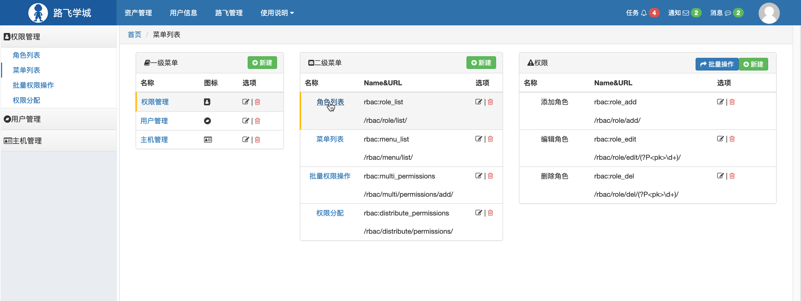
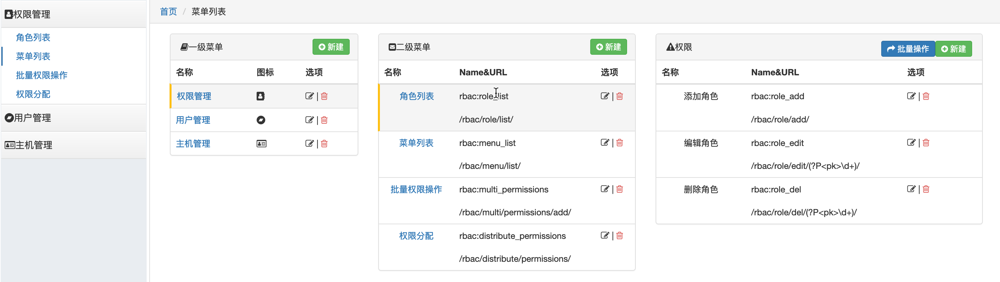

[TOC]


## 1. 权限组件介绍

### 1.1 为什么需要权限控制

```
针对不同的用户进行不同权限的操作
```


### 1.2 为什么开发权限控制组件

```
基本所有的系统都会有关于权限的操作
```


### 1.3 权限是什么

```
一个权限就是一个URL
不同的URL对应不同的请求，一个请求就是对应一个应答，而应答的结果就是用户能否有权限访问的资源，因此一个用户有多少权限，就是该用户有多少个URL
```


### 1.4 权限组件界面展示




## 2. 权限表结构设计

该组件一共涉及到6张表，分别如下：

- 用户表
- 角色表
- 权限表
- 用户和角色关系表
- 角色和权限关系表
- 菜单表

### 2.1 用户表

```python
class User(models.Model):
    """
    用户表
    """
    name = models.CharField(max_length=32, verbose_name='用户名')
    password = models.CharField(max_length=32, verbose_name='密码')
    email = models.CharField(max_length=32, verbose_name='邮箱')
    roles = models.ManyToManyField(to=Role, verbose_name='拥有的所有角色', blank=True)

    def __str__(self):
        return self.name

    class Meta:
        # 做数据库迁移时，不会为该类创建相应的表，在其子类做数据迁移时会创建该类对应的表
        abstract = True
```

用户信息无法满足所有系统的使用，如可能用户还需要部门，等级，电话等，所以将用户类变成抽象类 `abstract = True`，在业务中继承**`User`**类，可以添加其他信息，如

```python
from rbac.models import User as rbacUser

class User(rbacUser):
    """
    用户表
    """
    phone = models.CharField(max_length=32, verbose_name='手机号')
    level_choices = (
        (1, 'T1'),
        (2, 'T2'),
        (3, 'T3'),
    )
    level = models.IntegerField(choices=level_choices, verbose_name='级别')
    depart = models.ForeignKey(to='Department', verbose_name='部门', on_delete=models.CASCADE)
```


### 2.2 角色表

```python
class Role(models.Model):
    """
    角色表
    """
    title = models.CharField(max_length=32, verbose_name='角色名称')
    permissions = models.ManyToManyField(to='Permission', verbose_name='拥有的所有权限', blank=True)

    def __str__(self):
        return self.title
```

之所以设计角色表，是想通过角色分配权限，而用户分配权限


### 2.3 权限表

```python
class Permission(models.Model):
    """
    权限表
    """
    title = models.CharField(max_length=32, verbose_name='标题')
    url = models.CharField(max_length=128, verbose_name='含正则的URL')
    name = models.CharField(max_length=32, verbose_name='URL的别名', unique=True)
    icon = models.CharField(max_length=64, verbose_name='图标', null=True, blank=True)
    menu = models.ForeignKey(to='Menu', verbose_name='所属的一级菜单', 
                             on_delete=models.CASCADE, null=True,
                             help_text='null表示不是菜单，否则代表二级菜单')
    pid = models.ForeignKey(to='Permission', related_name='parents', 
                            verbose_name='关联的权限', 
                            help_text='该权限不是菜单，关联一个权限',
                            null=True, on_delete=models.CASCADE)

    def __str__(self):
        return self.title
```

在权限表中，menu指的是所属菜单，如果不为空，则该URL对应的二级菜单，pid指的是所属二级菜单，通常menu和pid为互斥的


### 2.4 用户和角色关系表

通过多对多生成

```python
roles = models.ManyToManyField(to=Role, verbose_name='拥有的所有角色', blank=True)
```


### 2.5 角色和关系表

通过对多生成

```python
 permissions = models.ManyToManyField(to='Permission', verbose_name='拥有的所有权限', blank=True)
```


### 2.6 菜单表

```python
class Menu(models.Model):
    """
    一级菜单表
    """
    title = models.CharField(max_length=32, verbose_name='一级菜单名称')
    icon = models.CharField(max_length=64, verbose_name='图标')

    def __str__(self):
        return self.title
```

菜单不代表权限，它是部分权限的一个分组，如在权限组件界面展示中的用户管理或者权限管理


备注：当然表的设计是经过几版设计改进得来的


## 3.基本权限控制

### 3.1 设计思路

一个系统的起始是从用户登录开始的，当用户通过登陆界面将用户名和密码传递至后端的时候，如果用户存在，将用户所有的权限信息存放到session中，当用户再次发起请求(一个URL)的时候，会携带session中的所有权限，我们判断访问权限是否在session中，从而确定该用户是否有该权限，我们可以在Django的中间键中进行该权限存在的判断


### 3.2 代码实现

#### 3.2.1 封装用户权限到session

备注：该方法中还有封装菜单到session中，后续介绍

```python
from django.conf import settings


def init_permission(user_obj, request):
    """
    用户权限的初始化
    :param user_obj: 当前登陆用户
    :param request: 请求
    :return:
    """

    # 本次查询垮了三张表，注意去重和为空的筛选
    permission_queryset = user_obj.roles.filter(permissions__isnull=False).values('permissions__id',
                                                                                  'permissions__title',
                                                                                  'permissions__url',
                                                                                  'permissions__name',
                                                                                  'permissions__pid__id',
                                                                                  'permissions__pid__title',
                                                                                  'permissions__pid__url',
                                                                                  'permissions__menu',
                                                                                  'permissions__icon',
                                                                                  'permissions__menu__id',
                                                                                  'permissions__menu__icon',
                                                                                  'permissions__menu__title',
                                                                                  ).distinct()
    # 获取权限中的所有URL+菜单
    menu_dict = {}  # 菜单
    permission_dict = {}  # URL
    for item in permission_queryset:
        permission_dict[item['permissions__name']] = {
            'id': item['permissions__id'],
            'url': item['permissions__url'],
            'pid': item['permissions__pid__id'],
            'title': item['permissions__title'],
            'p_title': item['permissions__pid__title'],
            'p_url': item['permissions__pid__url'],
        }
        menu_id = item['permissions__menu__id']
        if not menu_id:
            continue
        node = {
            'title': item['permissions__title'],
            'url': item['permissions__url'],
            'icon': item['permissions__icon'],
            'id': item['permissions__id']
        }
        if menu_id in menu_dict:
            menu_dict[menu_id]['children'].append(node)
        else:
            menu_dict[menu_id] = {
                'title': item['permissions__menu__title'],
                'icon': item['permissions__menu__icon'],
                'children': [node],
            }
    # 将权限信息写入session中
    request.session[settings.PERMISSION_SESSION_KEY] = permission_dict
    # 将菜单信息写入session中
    request.session[settings.MENU_SESSION_KEY] = menu_dict

```

#### 3.2.2 在中间件判断用户是否有权限

```python
import re
from django.conf import settings
from django.shortcuts import HttpResponse
from django.utils.deprecation import MiddlewareMixin


class RbacMiddleware(MiddlewareMixin):
    """
    用户权限信息校验
    """

    def process_request(self, request):
        """
        验证用户权限
        :param request:
        :return:
        """
        # 获取当前请求的url
        current_url = request.path_info

        # 判断url是否在白名单里面
        for item in settings.VALID_URL_LIST:
            item = "^%s$" % item
            if re.match(item, current_url):
                return None
        url_record = [
            {'url': '#', 'title': '首页'}
        ]
        # 判断是否需要登陆但无需权限的URL
        for item in settings.NO_PERMISSION_LIST:
            item = "^%s$" % item
            if re.match(item, current_url):
                request.current_selected_permission = 0
                request.url_record = url_record
                return None

        # 获取当前用户session中的权限
        permission_dict = request.session[settings.PERMISSION_SESSION_KEY]
        if not permission_dict:
            return HttpResponse('为获取用户权限信息，请登录')

        # 判断用户当前请求是否在session中
        flag = False
        for item in permission_dict.values():
            # 匹配应该严格
            reg = "^%s$" % (item['url'],)
            # 用户拥有权限
            if re.match(reg, current_url):
                flag = True
                # 菜单选中
                request.current_selected_permission = item['pid'] or item['id']
                # 导航条
                if not item['pid']:
                    url_record.append(
                        {'url': item['url'], 'title': item['title']}
                    )
                else:
                    url_record.extend([
                        {'url': item['p_url'], 'title': item['p_title']},
                        {'url': item['url'], 'title': item['title']}
                    ])
                request.url_record = url_record
                break

        if not flag:
            return HttpResponse('无权访问')

```

### 3.3 知识点

1. ORM的跨表查询
2. session的使用
3. 中间件
4. 正则匹配


## 4.动态菜单的实现

菜单常见的有一级菜单和二级菜单，下面采用二级菜单设计

### 4.1 设计思路

一级菜单就是菜单表中的数据，二级菜单为权限表中menu不为空的数据，pid不为空的权限无法成为菜单，但在二级菜单之下

构建对应的数据结构，保存在用户的session中，当用户通过中间件的权限校验后，将数据渲染在页面中

### 4.2 代码实现

#### 4.2.1 封装菜单信息到session中

同 3.2.1 封装用户权限到session

构建`menu_dict`
格式如下：

```python
{
    1: {
        'title': '信息管理',
        'icon': 'x1',
        'children': [
            {'title': '客户列表', 'url': '/customer/list/', 'icon': 'x2'},
            {'title': '张丹列表', 'url': '/payment/list/', 'icon': 'x3'}
        ]

    },
    2: {
        'title': '用户信息',
        'icon': 'x4',
        'children': [
            {'title': '个人资料', 'url': '/userInfo/list/', 'icon': 'x5'},
        ]

    }
}
```


#### 4.2.2 渲染页面

使用inclusion_tag将动态菜单的渲染界面抽离出来

```python
from rbac.service import urls
from django.conf import settings
from collections import OrderedDict
from django.template import Library

register = Library()

@register.inclusion_tag('rbac/multi_menu.html')
def multi_menu(request):
    """
    创建二级菜单
    :return:
    """
    menu_dict = request.session.get(settings.MENU_SESSION_KEY)
    # 将无序的字典转换为有序的
    key_list = sorted(menu_dict)
    ordered_dict = OrderedDict()

    for key in key_list:
        val = menu_dict[key]
        val['class'] = 'hide'
        for per in val['children']:
            if per['id'] == request.current_selected_permission:
                val['class'] = ''
                per['class'] = 'active'
        ordered_dict[key] = val

    return {'ordered_dict': ordered_dict}
```

rbac/multi_menu.html代码：

双重循环渲染

```html
<div class="multi-menu">
    
    <div class="item">
        <div class="title" ><span class="icon-wrap"><i class="{{ item.icon }}"></i></span>{{ item.title }}
        </div>
        <div class="body {{ item.class }}">
            
            <a href="{{ per.url }}" class="{{ per.class }}">{{ per.title }}</a>
            
        </div>
    </div>
    
</div>
```

模板文件layout.html中

```html


...
    <div class="left-menu">
        <div class="menu-body">
            
        </div>
    </div>
    ...
```

### 4.3 知识点

1. ORM的跨表查询
2. session的使用
3. Inclusion_tag的使用
4. 数据封装

## 5.导航条制作


### 5.1设计思路

1. 在中间件校验权限的时候，将当前访问的URL权限构建在一个列表中，封装到request中
2. 在访问的页面进行渲染的时候将request传递给模板的中
3. 在模板中使用inclusion_tag进行渲染，取出封装在requet中的导航列表数据

### 5.2 代码设计

封装导航条的数据结构为url_record，封装到request中

```python
import re
from django.conf import settings
from django.shortcuts import HttpResponse
from django.utils.deprecation import MiddlewareMixin


class RbacMiddleware(MiddlewareMixin):
    """
    用户权限信息校验
    """

    def process_request(self, request):
        """
        验证用户权限
        :param request:
        :return:
        """
        # 获取当前请求的url
        current_url = request.path_info

        # 判断url是否在白名单里面
        for item in settings.VALID_URL_LIST:
            item = "^%s$" % item
            if re.match(item, current_url):
                return None
        url_record = [
            {'url': '#', 'title': '首页'}
        ]
        # 判断是否需要登陆但无需权限的URL
        for item in settings.NO_PERMISSION_LIST:
            item = "^%s$" % item
            if re.match(item, current_url):
                request.current_selected_permission = 0
                request.url_record = url_record
                return None

        # 获取当前用户session中的权限
        permission_dict = request.session[settings.PERMISSION_SESSION_KEY]
        if not permission_dict:
            return HttpResponse('为获取用户权限信息，请登录')

        # 判断用户当前请求是否在session中
        flag = False
        for item in permission_dict.values():
            # 匹配应该严格
            reg = "^%s$" % (item['url'],)
            # 用户拥有权限
            if re.match(reg, current_url):
                flag = True
                # 菜单选中
                request.current_selected_permission = item['pid'] or item['id']
                # 导航条
                if not item['pid']:
                    url_record.append(
                        {'url': item['url'], 'title': item['title']}
                    )
                else:
                    url_record.extend([
                        {'url': item['p_url'], 'title': item['p_title']},
                        {'url': item['url'], 'title': item['title']}
                    ])
                request.url_record = url_record
                break

        if not flag:
            return HttpResponse('无权访问')

```

模板文件layout.html

```html
...
<div>
	
</div>
```

Inclusion_tag函数

```python
@register.inclusion_tag('rbac/url_record.html')
def url_record(request):
    return {'url_record': request.url_record}
```

模板文件rbac/url_record.html

```html
<div>
    <ol class="breadcrumb no-radius no-margin" style="border-bottom: 1px solid #ddd;">

        
            
                <li>{{ item.title }}</li>
            
                <li><a href="{{ item.url }}">{{ item.title }}</a></li>
        
        

    </ol>
</div>
```


### 5.3知识点

1. 中间件
2. inclusion_tag的使用
3. 数据封装到request中

## 6.权限控制力度到按钮

将页面上的每一个按钮或者说是权限赋予权限控制，当用户有所有权限的时候，页面展示的按钮可能比较多，而其他用户可能只能显示自身具有权限的按钮

例如kunmzhao用户显示的页面

alex1显示的页面


### 6.1 设计思路

首先按钮肯定定义在html的模板文件中，我们在渲染模板文件的时候判断按钮对应的URL是否在我们之前封装在session中，如果在，就渲染在页面，否则隐藏

为了在前端引用URL方便，我们为每个URL都起一个别名，如：

```python
url('^role/list/$', role.role_list, name='role_list'),
url('^role/add/$', role.role_add, name='role_add'),
url('^role/edit/(?P<pk>\d+)/$', role.role_edit, name='role_edit'),
url('^role/del/(?P<pk>\d+)/$', role.role_del, name='role_del'),
```

### 6.2 代码实现

自定义过滤器

```python
@register.filter
def has_permission(request, name):
    """
    判断是否有权限
    :param request:请求
    :param name: url的别名
    :return:
    """
    if name in request.session.get(settings.PERMISSION_SESSION_KEY):
        return True
```


页面中渲染按钮举例
当名称为host_add的url存在当前用户的session中时，就可以渲染在页面

```html
...

  <a class="btn btn-default" href="">
  		<i class="fa fa-plus-square" aria-hidden="true"></i> 添加主机
  </a>

    
```


### 6.3 知识点

1. 自定义过滤器
2. session
3. 权限别名的使用

## 7.权限分配

### 7.1 角色表管理

对角色表的增删改查


角色表对应的ModelForm

```python
from django import forms

from rbac.models import Role


class RoleModelForm(forms.ModelForm):
    class Meta:
        model = Role
        fields = ['title']
        widgets = {
            'title': forms.TextInput(attrs={'class': 'form-control'})
        }

```

视图函数

```python
from django.urls import reverse
from django.shortcuts import render, HttpResponse, redirect

from rbac.models import Role
from rbac.forms.role import RoleModelForm


def role_list(request):
    """
    角色列表
    :param request:
    :return:
    """
    role_queryset = Role.objects.all()
    return render(request, 'rbac/role_list.html', {"role_queryset": role_queryset})


def role_add(request):
    """
    添加角色
    :param request:
    :return:
    """
    if request.method == 'GET':
        form = RoleModelForm()
        return render(request, 'rbac/change.html', {'form': form})
    form = RoleModelForm(data=request.POST)
    if form.is_valid():
        form.save()
        return redirect(reverse('rbac:role_list'))
    else:
        return render(request, 'rbac/change.html', {'form': form})


def role_edit(request, pk):
    """
    编辑角色
    :param request:
    :param pk:要修改的角色ID
    :return:
    """
    role_obj = Role.objects.filter(id=pk).first()
    if not role_obj:
        return HttpResponse('角色不存在')
    if request.method == 'GET':
        form = RoleModelForm(instance=role_obj)
        return render(request, "rbac/change.html", {'form': form})
    form = RoleModelForm(data=request.POST, instance=role_obj)
    if form.is_valid():
        form.save()
        return redirect(reverse("rbac:role_list"))
    else:
        return render(request, "rbac/change.html", {'form': form})


def role_del(request, pk):
    """
    删除角色
    :param request:
    :param pk:
    :return:
    """
    origin_url = reverse('rbac:role_list')
    if request.method == "GET":
        return render(request, 'rbac/role_del.html', {'cancel': origin_url})

    Role.objects.filter(id=pk).delete()
    return redirect(origin_url)
```

模板文件role_list.html

```html



<div class="luffy-container">
    <div class="btn-group" style="margin: 5px 0">
        <a class="btn btn-default" href="">
            <i class="fa fa-plus-square" aria-hidden="true"></i> 添加角色
        </a>
    </div>
    <table class="table table-bordered table-hover">
        <thead>
        <tr>
            <th>ID</th>
            <th>名称</th>
            <th>选项</th>
        </tr>
        </thead>
        <tbody>
        
        <tr>
            <td>{{ row.id }}</td>
            <td>{{ row.title }}</td>
            <td>
                <a style="color: #333333;" href="">
                    <i class="fa fa-edit" aria-hidden="true"></i></a>
                |
                <a style="color: #d9534f;" href="">
                    <i class="fa fa-trash-o"></i></a>
            </td>
        </tr>
        
        </tbody>
    </table>
</div>


```

模板文件change.html，针对修改和新增角色

```html


ul{
list-style-type:none;
padding:0px
}
ul li{
float:left;
padding:10px;
padding-left:0;
width:80px;
}
ul li i{
font-size:18px;
margin-left:5px;
color:#6d6565;
}




<div class="luffy-container">

    <form action="" method="post" class="form-horizontal">
        
        
        <div class="form-group">
            <label class="col-sm-2 control-label">{{ filed.label }}</label>
            <div class="col-sm-8">
                {{ filed }}
                <span style="color: red"> {{ filed.errors.0}}</span>
            </div>
        </div>
        
        <div class="form-group">
            <div class="col-sm-offset-2 col-sm-8">
                <input type="submit" value="保 存" class="btn btn-primary">
            </div>
        </div>
    </form>
</div>


```

模板文件menu_del.html

```html




<div class="luffy-container">

    <div class="alert alert-danger" role="alert">
        <form action="" method="post">
            
            <p style="font-size: 13px;">
                <i class="fa fa-warning" aria-hidden="true"></i>
                删除后不可恢复，请确认是否删除
            </p>
            <div style="margin-top: 20px">
                <a href="{{ cancel }}" class="btn btn-default btn-sm">取 消</a>
                <button type="submit" class="btn btn-danger btn-sm">确 认</button>
            </div>
        </form>
    </div>
</div>


```

知识点：

1. ModeForm的使用
2. form表单的使用
3. 反向生成URL

### 7.2 菜单管理




菜单管理中涉及到菜单表，权限表

#### 7.2.1 一级菜单

一级菜单就是对菜单表的增删该查，过程类似角色表管理
一级菜单的ModeForm

```python
class MenuModelForm(forms.ModelForm):
    class Meta:
        model = Menu
        fields = '__all__'
        widgets = {
            'title': forms.TextInput(attrs={'class': 'form-control'}),
            'icon': forms.RadioSelect(
                choices=ICON_LIST
            )
        }
        labels = {
            'title': '菜单名称'
        }
```

视图函数

```python
def menu_list(request):
    """
    菜单列表
    :param request:
    :return:
    """
    menu_queryset = Menu.objects.all()
    # 一级菜单
    menu_id = request.GET.get('mid')
    is_exist = Menu.objects.filter(id=menu_id).exists()
    if not is_exist:
        menu_id = None
    # 二级菜单
    second_menu_id = request.GET.get('sid')
    is_exist = Permission.objects.filter(id=second_menu_id).exists()
    if not is_exist:
        second_menu_id = None
    if menu_id:
        second_menus = Permission.objects.filter(menu_id=menu_id)
    else:
        second_menus = []
    # 权限
    if second_menu_id:
        permissions = Permission.objects.filter(pid=second_menu_id)
    else:
        permissions = []
    return render(request, 'rbac/menu_list.html', {
        "menu_queryset": menu_queryset,
        'menu_id': menu_id,
        "second_menus": second_menus,
        "second_menu_id": second_menu_id,
        "permissions": permissions,
    })


def menu_add(request):
    """
    添加菜单
    :param request:
    :return:
    """
    if request.method == 'GET':
        form = MenuModelForm()
        return render(request, 'rbac/change.html', {'form': form})
    form = MenuModelForm(request.POST)
    if form.is_valid():
        form.save()
        return redirect(memory_reverse(request, 'rbac:menu_list'))
    return render(request, 'rbac/change.html', {'form': form})


def menu_edit(request, pk):
    """
    编辑菜单
    :param request:
    :param pk:
    :return:
    """
    menu_obj = Menu.objects.filter(id=pk).first()
    if not menu_obj:
        return HttpResponse('菜单不存在')
    if request.method == "GET":
        form = MenuModelForm(instance=menu_obj)
        return render(request, 'rbac/change.html', {'form': form})
    form = MenuModelForm(data=request.POST, instance=menu_obj)
    if form.is_valid():
        form.save()
        return redirect(memory_reverse(request, 'rbac:menu_list'))
    return render(request, 'rbac/change.html', {'form': form})


def menu_del(request, pk):
    """
    删除菜单
    :param request:
    :param pk:
    :return:
    """
    menu_obj = Menu.objects.filter(id=pk).first()
    origin_url = memory_reverse(request, 'rbac:menu_list')
    if not menu_obj:
        return HttpResponse('菜单不存在')
    if request.method == 'GET':
        return render(request, 'rbac/menu_del.html', {'cancel': origin_url})
    Menu.objects.filter(id=pk).delete()
    return redirect(origin_url)
```

模板文件略

#### 7.2.2 二级菜单

二级菜单就是权限表中menu不为空的URL, 然后对这些权限进行增删改查渲染在页面
二级菜单的ModelForm:

```python
class SecondMenuModelForm(forms.ModelForm):
    class Meta:
        model = Permission
        fields = ['title', 'url', 'name', 'menu']

    def __init__(self, *args, **kwargs):
        super(SecondMenuModelForm, self).__init__(*args, **kwargs)
        for name, filed in self.fields.items():
            filed.widget.attrs['class'] = 'form-control'
```

视图函数

```python
def second_menu_add(request, menu_id):
    """
    添加二级菜单
    :param request:
    :param menu_id:
    :return:
    """
    menu_object = Menu.objects.filter(id=menu_id).first()
    if request.method == "GET":
        form = SecondMenuModelForm(initial={'menu': menu_object})
        return render(request, 'rbac/change.html', {"form": form})
    form = SecondMenuModelForm(request.POST)
    if form.is_valid():
        form.save()
        return redirect(memory_reverse(request, 'rbac:menu_list'))
    return render(request, 'rbac/change.html', {'form': form})


def second_menu_edit(request, pk):
    """
    编辑二级菜单
    :param request:
    :param menu_id:
    :return:
    """
    second_menu_obj = Permission.objects.filter(id=pk).first()
    if not second_menu_obj:
        return HttpResponse('二级菜单不存在')
    if request.method == "GET":
        form = SecondMenuModelForm(instance=second_menu_obj)
        return render(request, 'rbac/change.html', {'form': form})
    form = SecondMenuModelForm(data=request.POST, instance=second_menu_obj)
    if form.is_valid():
        form.save()
        return redirect(memory_reverse(request, 'rbac:menu_list'))
    return render(request, 'rbac/change.html', {'form': form})


def second_menu_del(request, pk):
    """

    :param request:
    :param menu_id:
    :return:
    """
    second_menu_obj = Permission.objects.filter(id=pk).first()
    origin_url = memory_reverse(request, 'rbac:menu_list')
    if not second_menu_obj:
        return HttpResponse('菜单不存在')
    if request.method == 'GET':
        return render(request, 'rbac/menu_del.html', {'cancel': origin_url})
    Permission.objects.filter(id=pk).delete()
    return redirect(origin_url)
```

模板文件略

知识点：

1. ModelForm的使用

2. form的使用

3. 自定义反向生成函数 simple_tag
   在本例中，添加二级菜单之后的返回页面，应该仍是添加之前的，也就是我们在跳转到添加界面时，需要保存之前URL

   ```
   # 添加之前URL
   http://127.0.0.1:8081/rbac/menu/list/?mid=1&sid=15	
   # 添加之后的重定向的URL
   http://127.0.0.1:8081/rbac/menu/list/?mid=1&sid=15
   ```

   在模板文件中，将菜单mid封装到request中

   ```html
   <a href=""
   	class="right btn btn-success btn-xs"
   	style="padding: 2px 8px; margin: -3px">
   		<i class="fa fa-plus-circle" aria-hidden="true"></i>
   		新建
   </a>
   ```

   ```python
   @register.simple_tag
   def memory_url(request, name, *args, **kwargs):
       """
       生成带有原有搜索条件的URL，替代模板中的
       :param request:
       :param name:
       :return:
       """
       return urls.memory_url(request, name, *args, **kwargs)
     
   ....
   
   def memory_url(request, name, *args, **kwargs):
       """
       生成带有原有搜索条件的URL
       :param request:
       :param name:
       :return:
       """
       base_url = reverse(name, args=args, kwargs=kwargs)
       # 当前url中无参数
       if not request.GET:
           return base_url
       query_dict = QueryDict(mutable=True)
       query_dict['_filter'] = request.GET.urlencode()
       return "%s?%s" % (base_url, query_dict.urlencode())
   ```

   在视图函数中从request中读取mid，并在之后的重定向中使用

   ```python
   return redirect(memory_reverse(request, 'rbac:menu_list'))
   ```

   ```python
   def memory_reverse(request, name, *args, **kwargs):
       """
       反向生成url
       :param request:
       :param name:
       :param args:
       :param kwargs:
       :return:
       """
       url = reverse(name, args=args, kwargs=kwargs)
       origin_params = request.GET.get('_filter')
       if origin_params:
           url = "%s?%s" % (url, origin_params)
       return url
   ```

#### 7.2.3 权限

权限就是权限表中menu字段为Null,但是pid不为空的，我们在选中二级菜单的时候，可以在权限面板中显示对应的权限，同时可以对权限进行增删改查

 权限ModelForm

```python
class PermissionModelForm(forms.ModelForm):
    def __init__(self, *args, **kwargs):
        super(PermissionModelForm, self).__init__(*args, **kwargs)
        for name, filed in self.fields.items():
            filed.widget.attrs['class'] = 'form-control'

    class Meta:
        model = Permission
        fields = ['title', 'name', 'url']
```

视图函数

```python
def permission_add(request, second_menu_id):
    """
    添加权限
    :param request:
    :param second_menu_id:
    :return:
    """
    if request.method == 'GET':
        form = PermissionModelForm()
        return render(request, 'rbac/change.html', {'form': form})
    form = PermissionModelForm(data=request.POST)
    if form.is_valid():
        second_menu_obj = Permission.objects.filter(id=second_menu_id).first()
        if not second_menu_obj:
            return HttpResponse('二级菜单不存在')
        # 添加权限表中的pid
        form.instance.pid = second_menu_obj
        form.save()
        return redirect(memory_reverse(request, 'rbac:menu_list'))
    return render(request, 'rbac/chang.html', {'form': form})


def permission_edit(request, pk):
    """
    修改权限
    :param request:
    :param second_menu_id:
    :return:
    """
    permission_obj = Permission.objects.filter(id=pk).first()
    if not permission_obj:
        return HttpResponse("权限不存在")
    if request.method == 'GET':
        form = PermissionModelForm(instance=permission_obj)
        return render(request, 'rbac/change.html', {'form': form})
    form = PermissionModelForm(data=request.POST, instance=permission_obj)
    if form.is_valid():
        form.save()
        return redirect(memory_reverse(request, 'rbac:menu_list'))
    return render(request, 'rbac/chang.html', {'form': form})


def permission_del(request, pk):
    """
    删除权限
    :param request:
    :param second_menu_id:
    :return:
    """
    permission_obj = Permission.objects.filter(id=pk).first()
    origin_url = memory_reverse(request, 'rbac:menu_list')
    if not permission_obj:
        return HttpResponse('权限不存在')
    if request.method == 'GET':
        return render(request, 'rbac/menu_del.html', {'cancel': origin_url})
    Permission.objects.filter(id=pk).delete()
    return redirect(origin_url)
```

模板文件略

知识点：类似二级菜单

### 7.3 批量操作权限


将数据库中的URL和项目中的URL进行对比

- 项目中有，数据库无，则新建
- 项目中无，数据库有，则删除
- 项目中和数据库都有则为可进行操作

知识点：

1. formset的使用
2. 项目中自动发现URL
3. 集合的使用

相关ModelForm

```python
class MultiAddPermissionForm(forms.Form):
    title = forms.CharField(widget=forms.TextInput(attrs={'class': 'form-control'}))
    url = forms.CharField(widget=forms.TextInput(attrs={'class': 'form-control'}))
    name = forms.CharField(widget=forms.TextInput(attrs={'class': 'form-control'}))
    menu_id = forms.ChoiceField(widget=forms.Select(attrs={'class': 'form-control'}), required=False,
                                choices=[(None, '------')])
    pid_id = forms.ChoiceField(widget=forms.Select(attrs={'class': 'form-control'}), required=False,
                               choices=[(None, '------')])

    def __init__(self, *args, **kwargs):
        super(MultiAddPermissionForm, self).__init__(*args, **kwargs)
        self.fields['menu_id'].choices += Menu.objects.values_list('id', 'title')
        self.fields['pid_id'].choices += Permission.objects.filter(pid__isnull=True).exclude(
            menu__isnull=True).values_list('id', 'title')


class MultiEditPermissionForm(forms.Form):
    id = forms.CharField(widget=forms.HiddenInput())
    title = forms.CharField(widget=forms.TextInput(attrs={'class': 'form-control'}))
    url = forms.CharField(widget=forms.TextInput(attrs={'class': 'form-control'}))
    name = forms.CharField(widget=forms.TextInput(attrs={'class': 'form-control'}))
    menu_id = forms.ChoiceField(widget=forms.Select(attrs={'class': 'form-control'}), required=False,
                                choices=[(None, '------')])
    pid_id = forms.ChoiceField(widget=forms.Select(attrs={'class': 'form-control'}), required=False,
                               choices=[(None, '------')])

    def __init__(self, *args, **kwargs):
        super(MultiEditPermissionForm, self).__init__(*args, **kwargs)
        self.fields['menu_id'].choices += Menu.objects.values_list('id', 'title')
        self.fields['pid_id'].choices += Permission.objects.filter(pid__isnull=True).exclude(
            menu__isnull=True).values_list('id', 'title')

```

之所以设计两个类，是因为在更新的时候，我们需要知道给对应的form进行更行，所以添加了一个隐藏字段id


视图函数

```python
def multi_permissions(request):
    """
    批量操作权限
    :param request:
    :return:
    """
    post_type = request.GET.get('type')
    generate_form_class = formset_factory(MultiAddPermissionForm, extra=0)
    update_form_class = formset_factory(MultiEditPermissionForm, extra=0)
    generate_formset = None
    update_formset = None
    # 批量增加
    if request.method == 'POST' and post_type == 'generate':
        formset = generate_form_class(request.POST)
        if formset.is_valid():
            object_list = []
            post_row_list = formset.cleaned_data
            has_error = False
            for i in range(0, formset.total_form_count()):
                row_dict = post_row_list[i]
                try:
                    new_object = Permission(**row_dict)
                    new_object.validate_unique()
                    object_list.append(new_object)
                except Exception as e:
                    formset.errors[i].update(e)
                    generate_formset = formset
                    has_error = True
            # 批量添加数据到数据库
            if not has_error:
                Permission.objects.bulk_create(object_list, batch_size=100)
        else:
            generate_formset = formset
    # 批量更新
    if request.method == 'POST' and post_type == 'update':
        formset = update_form_class(request.POST)
        if formset.is_valid():
            post_row_list = formset.cleaned_data
            print(formset.total_form_count())
            for i in range(0, formset.total_form_count()):
                row_dict = post_row_list[i]
                permission_id = row_dict.pop('id')
                try:
                    row_object = Permission.objects.filter(id=permission_id).first()
                    for k, v in row_dict.items():
                        setattr(row_object, k, v)
                    row_object.validate_unique()
                    row_object.save()
                except Exception as e:
                    formset.errors[i].update(e)
                    update_formset = formset
        else:
            update_formset = formset
    # 1. 获取项目中的所有URL
    all_url_dict = get_all_url_dict()
    router_name_set = set(all_url_dict.keys())

    # 2.获取数据库中的所有URL
    permissions_queryset = Permission.objects.all().values('id', 'title', 'name', 'url', 'menu_id', 'pid_id')
    permission_dict = OrderedDict()
    for row in permissions_queryset:
        permission_dict[row['name']] = row
    permission_name_set = set(permission_dict.keys())

    # 防止数据库和路由中name一样但是url不一致
    for name, value in permission_dict.items():
        router_url_dict = all_url_dict.get(name)
        if not router_url_dict:
            continue
        if router_url_dict['url'] != all_url_dict[name].get('url'):
            value['url'] = '路由和数据库不一致！'

    # 3.1 增加到数据库的权限
    if not generate_formset:
        generate_name_list = router_name_set - permission_name_set
        generate_formset = generate_form_class(
            initial=[row_dict for name, row_dict in all_url_dict.items() if name in generate_name_list])

    # 3.2 从数据库中删除的权限
    delete_name_list = permission_name_set - router_name_set
    delete_row_list = [row_dict for name, row_dict in permission_dict.items() if name in delete_name_list]

    # 3.3 更新到到数据库的权限
    if not update_formset:
        update_name_list = permission_name_set & router_name_set
        update_formset = update_form_class(
            initial=[row_dict for name, row_dict in permission_dict.items() if name in update_name_list])

    return render(request, 'rbac/multi_permissions.html', {
        'generate_formset': generate_formset,
        'delete_row_list': delete_row_list,
        'update_formset': update_formset,
    })
```

发现项目中的URL(递归)

```python
import re
from django.conf import settings
from collections import OrderedDict
from django.urls import URLPattern, URLResolver
from django.utils.module_loading import import_string


def check_url_exclude(url):
    """
    排除特定的URL
    :param url:
    :return:
    """
    for regex in settings.AUTO_DISCOVER_EXCLUDE:
        if re.match(regex, url):
            return True


def recursion_urls(pre_namespace, pre_url, urlpatterns, url_ordered_dict):
    """
    递归获取URL
    :param pre_namespace:namespace前缀，拼接name
    :param pre_url:url的前缀
    :param urlpatterns:路由关系列表
    :param url_ordered_dict:用于保存递归中获取的URL
    :return:
    """
    for item in urlpatterns:
        # 非路由分发
        if isinstance(item, URLPattern):
            # 没有别名name
            if not item.name:
                continue
            if pre_namespace:
                name = "%s:%s" % (pre_namespace, item.name)
            else:
                name = item.name
            # 拼接URL
            url = pre_url + item.pattern.regex.pattern
            url = url.replace('^', '').replace('$', '')  # 去掉终止符和起始符
            if check_url_exclude(url):
                continue
            url_ordered_dict[name] = {'name': name, 'url': url}
        # 路由分发，递归操作
        elif isinstance(item, URLResolver):
            if pre_namespace:
                if item.namespace:
                    namespace = "%s:%s" % (pre_namespace, item.namespace)
                else:
                    namespace = pre_namespace
            else:
                if item.namespace:
                    namespace = item.namespace
                else:
                    namespace = None
            recursion_urls(namespace, pre_url + item.pattern.regex.pattern, item.url_patterns, url_ordered_dict)
        else:
            continue


def get_all_url_dict():
    """
    获取项目中的所有URL（必须有name别名）
    :return:
    """
    url_ordered_dict = OrderedDict()
    # 以字符串的形式导入模块
    md = import_string(settings.ROOT_URLCONF)
    # 递归获取所有的路由
    recursion_urls(None, '/', md.urlpatterns, url_ordered_dict)
    return url_ordered_dict

```


### 7.4 权限分配


#### 7.4.1 用户的展示

对用户表进行展示

该用户表为业务中自定义的用户表，且继承了rbac中的用户表

#### 7.4.2 角色的展示

对角色表进行展示

#### 7.4.3 权限的分配

视图函数

```python
def distribute_permissions(request):
    """
    权限的分配
    :param request:
    :return:
    """
    uid = request.GET.get('uid')
    rid = request.GET.get('rid')

    user_obj = import_string(settings.RBAC_USER_MODEL_CLASS).objects.filter(id=uid).first()
    role_obj = Role.objects.filter(id=rid).first()

    if request.method == 'POST' and request.POST.get('type') == 'role':
        role_id_list = request.POST.getlist('roles')
        if not user_obj:
            return HttpResponse('请选择用户,再分配角色')
        user_obj.roles.set(role_id_list)
    if request.method == "POST" and request.POST.get('type') == 'permission':
        permission_id_list = request.POST.getlist('permissions')
        if not role_obj:
            return HttpResponse('请选择角色，再分配权限')
        role_obj.permissions.set(permission_id_list)
    if not user_obj:
        uid = None

    if uid:
        # 获取当前用户所拥有的所有角色
        user_has_roles = user_obj.roles.all()
        # 获取当前用户所拥有的权限
        user_has_permissions = user_obj.roles.filter(permissions__id__isnull=False).values('permissions__id').distinct()
    else:
        user_has_roles = []
        user_has_permissions = []
    user_has_roles_dict = {item.id: item for item in user_has_roles}
    user_has_permissions_dict = {item['permissions__id']: None for item in user_has_permissions}

    flag = False
    if not role_obj:
        rid = None
        role_has_permissions = []
    # 选中角色的时候，权限优先显示对应角色的权限
    else:
        role_has_permissions = role_obj.permissions.all()
        flag = True
    role_has_permissions_dict = {item.id: None for item in role_has_permissions}

    # 获取所有用户
    all_user_list = import_string(settings.RBAC_USER_MODEL_CLASS).objects.all()

    # 获取所有的角色
    all_role_list = Role.objects.all()

    # 获取所有的一级菜单
    all_menu_list = Menu.objects.all().values('id', 'title')
    all_menu_dict = {}
    for item in all_menu_list:
        item['children'] = []
        all_menu_dict[item['id']] = item

    # 获取所有的二级菜单
    all_second_menu_list = Permission.objects.filter(menu__isnull=False).values('id', 'title', 'menu_id')
    all_second_menu_dict = {}
    for item in all_second_menu_list:
        item['children'] = []
        all_second_menu_dict[item['id']] = item
        all_menu_dict[item['menu_id']]['children'].append(item)

    # 获取所有的三级菜单
    all_permissions_list = Permission.objects.filter(menu__isnull=True).values('id', 'title', 'pid_id')
    for item in all_permissions_list:
        pid = item['pid_id']
        if not pid:
            continue
        all_second_menu_dict[pid]['children'].append(item)
    return render(request, 'rbac/distibute_permissions.html', {
        'user_list': all_user_list,
        'role_list': all_role_list,
        'all_menu_list': all_menu_list,
        'uid': uid,
        'user_has_roles_dict': user_has_roles_dict,
        'user_has_permissions_dict': role_has_permissions_dict if flag else user_has_permissions_dict,
        'rid': rid
    })
```

知识点：
构建渲染模板文件的数据结构`all_menu_list`, 结构类似, 赋值是地址拷贝

```
< QuerySet[{
	'id': 1,
	'title': '权限管理',
	'children': [{
		'id': 11,
		'title': '角色列表',
		'menu_id': 1,
		'children': [{
			'id': 12,
			'title': '添加角色',
			'pid_id': 11
		}, {
			'id': 13,
			'title': '编辑角色',
			'pid_id': 11
		}, {
			'id': 14,
			'title': '删除角色',
			'pid_id': 11
		}]
	}, {
		'id': 15,
		'title': '菜单列表',
		'menu_id': 1,
		'children': [{
			'id': 16,
			'title': '一级菜单添加',
			'pid_id': 15
		}, {
			'id': 17,
			'title': '一级菜单编辑',
			'pid_id': 15
		}, {
			'id': 18,
			'title': '一级菜单删除',
			'pid_id': 15
		}, {
			'id': 19,
			'title': '二级菜单添加',
			'pid_id': 15
		}, {
			'id': 20,
			'title': '二级菜单编辑',
			'pid_id': 15
		}, {
			'id': 21,
			'title': '二级菜单删除',
			'pid_id': 15
		}, {
			'id': 22,
			'title': '权限添加',
			'pid_id': 15
		}, {
			'id': 23,
			'title': '权限编辑',
			'pid_id': 15
		}, {
			'id': 24,
			'title': '权限删除',
			'pid_id': 15
		}]
	}, {
		'id': 25,
		'title': '批量权限操作',
		'menu_id': 1,
		'children': [{
			'id': 26,
			'title': '批量权限删除',
			'pid_id': 25
		}]
	}, {
		'id': 27,
		'title': '权限分配',
		'menu_id': 1,
		'children': []
	}]
}, {
	'id': 2,
	'title': '用户管理',
	'children': [{
		'id': 2,
		'title': '用户列表',
		'menu_id': 2,
		'children': [{
			'id': 3,
			'title': '添加用户',
			'pid_id': 2
		}, {
			'id': 4,
			'title': '编辑用户',
			'pid_id': 2
		}, {
			'id': 5,
			'title': '删除用户',
			'pid_id': 2
		}, {
			'id': 6,
			'title': '重置密码',
			'pid_id': 2
		}]
	}]
}, {
	'id': 3,
	'title': '主机管理',
	'children': [{
		'id': 7,
		'title': '主机列表',
		'menu_id': 3,
		'children': [{
			'id': 8,
			'title': '添加主机',
			'pid_id': 7
		}, {
			'id': 9,
			'title': '编辑主机',
			'pid_id': 7
		}, {
			'id': 10,
			'title': '删除主机',
			'pid_id': 7
		}]
	}]
}] >
```

